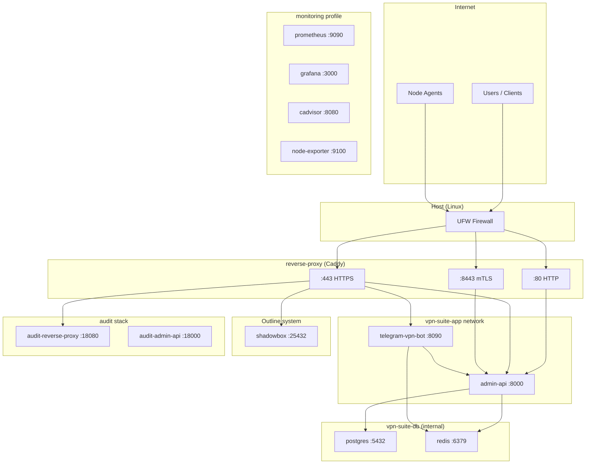
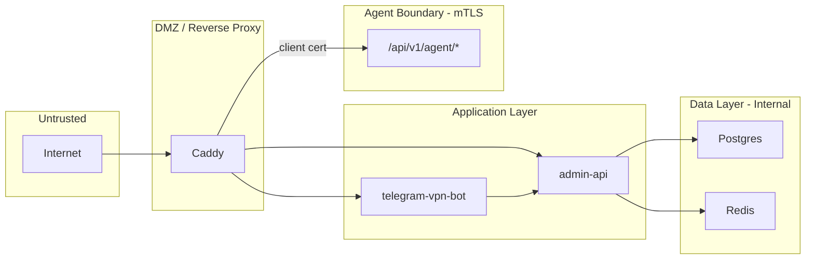

# VPN Infrastructure Map

**Audit Date:** 2025-02-21  
**Scope:** VPN Suite (control plane + AmneziaWG nodes) + Outline + monitoring

---

## 1. Service Topology

---

## 2. Exposed Surface

### Externally exposed (0.0.0.0 / host ports)

| Port | Service | UFW | Notes |
|------|---------|-----|-------|
| 22 | SSH | ALLOW | Brute-force risk; no fail2ban |
| 80 | Caddy HTTP | ALLOW | Redirect to HTTPS |
| 443 | Caddy HTTPS | ALLOW | API, admin, webapp, outline-api |
| 8443 | Caddy mTLS | ALLOW | Agent API only (client cert required) |
| 8090 | Telegram bot | Not in UFW | Docker-published; reachable if Docker rules apply |
| 3000 | Grafana | Not in UFW | Monitoring profile |
| 8080 | cAdvisor | Not in UFW | Monitoring profile |
| 9100 | node-exporter | Not in UFW | Monitoring profile |
| 18080 | Audit Caddy | - | Audit stack |
| 18000 | Audit admin-api | - | Audit stack (direct) |
| 25432 | Outline API | ALLOW | Outline Manager |
| 45790/udp | AmneziaWG | ALLOW | VPN traffic |
| 47604/udp | WireGuard | ALLOW | (legacy) |
| 58294 tcp/udp | Outline keys | ALLOW | Shadowsocks |
| 1024-65535 tcp/udp | Outline key range | ALLOW | Dynamic Shadowsocks |

### Internal only (127.0.0.1 / Docker internal network)

| Port | Service |
|------|---------|
| 8000 | admin-api (localhost only) |
| 9090 | Prometheus |
| 6379 | redis-server (host), redis container |
| 5432 | Postgres containers |

---

## 3. Trust Boundaries

| Boundary | Controls |
|----------|----------|
| Internet → Caddy | UFW allow 80, 443, 8443; TLS on 443/8443 |
| Caddy → admin-api | Internal Docker network; admin-api localhost-only on host |
| Caddy → Agent API | mTLS (client cert), X-Agent-Token, optional AGENT_ALLOW_CIDRS |
| Caddy → Bot | Bot health/metrics; Bot receives Telegram webhooks on 8090 |
| admin-api ↔ Postgres/Redis | vpn-suite-db internal network; no host exposure |
| Node agents → Control plane | mTLS + AGENT_SHARED_TOKEN |

---

## 4. Docker Containers (Observed)

| Container | Image | Ports | Network |
|-----------|-------|-------|---------|
| vpn-suite-reverse-proxy | vpn-suite-reverse-proxy:local | 80, 443, 8443 | vpn-suite-app |
| vpn-suite-admin-api | vpn-suite-admin-api | 127.0.0.1:8000 | app, db |
| vpn-suite-telegram-vpn-bot | vpn-suite-telegram-vpn-bot | 0.0.0.0:8090 | app, db |
| vpn-suite-postgres | postgres | internal | vpn-suite-db |
| vpn-suite-redis | redis | internal | vpn-suite-db |
| vpn-suite-node-agent | vpn-suite-node-agent | 9105 | vpn-suite-app |
| shadowbox | quay.io/outline/shadowbox | - | outline |
| vpn-suite-grafana | grafana/grafana | 0.0.0.0:3000 | app |
| vpn-suite-cadvisor | gcr.io/cadvisor/cadvisor | 0.0.0.0:8080 | app |
| vpn-suite-node-exporter | prom/node-exporter | 0.0.0.0:9100 | app |
| vpn-suite-audit-* | - | 18080, 18000 | audit stack |

---

## 5. System Configuration Snapshot

| Parameter | Value |
|-----------|-------|
| net.core.somaxconn | 1024 |
| net.ipv4.tcp_max_syn_backlog | 2048 |
| net.netfilter.nf_conntrack_max | 65536 |
| fs.file-max | 200000 |
| ulimit -n | 1048576 |

---

## 6. Systemd Services (Relevant)

- docker, containerd
- ssh (OpenSSH)
- redis-server (host)
- cron, rsyslog, systemd-timesyncd
- unattended-upgrades
