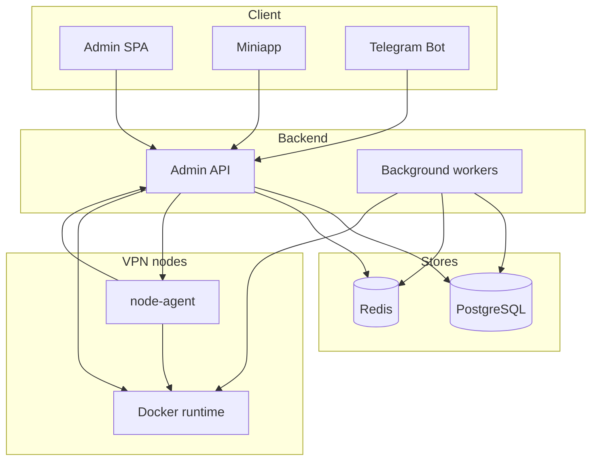

# VPN Suite — System Map

**Scope:** vpn-suite (AmneziaWG control plane) and [amnezia-awg2](../amnezia/amnezia-awg2/) (VPN data-plane). Last updated from full-repo optimization audit.

---

## 1. Inventory

| Layer    | Component | Location | Stack |
| -------- | --------- | -------- | ----- |
| Frontend | Admin SPA | `frontend/admin/` | React, Vite, TanStack Query |
| Frontend | Miniapp   | `frontend/miniapp/` | React, Vite |
| Frontend | Shared     | `frontend/shared/` | UI, types, api-client |
| Backend  | Admin API  | `backend/` | FastAPI, SQLAlchemy async, Redis |
| Node     | Node agent | `node-agent/` | Python, Docker SDK, AmneziaWG exec |
| Workers  | Telemetry poll, reconciliation, health, sync, expiry, docker alerts | `backend/app/core/*_task.py` | Background asyncio loops |
| Bot      | Telegram bot | `bot/` | Python, aiogram |
| Infra    | Docker     | `docker-compose.yml`, `backend/Dockerfile` | postgres, redis, admin-api, reverse-proxy, node-agent, etc. |
| Infra    | VPN data-plane | `../amnezia/amnezia-awg2/` | AmneziaWG container only; node-agent runs alongside or separately |
| CI       | Lint, build, E2E, Trivy, secrets | `.github/workflows/ci.yml` | Sequential jobs; npm/pip; Playwright |

---

## 2. Data flow

- **Admin UI / Miniapp → Admin API only.** Browsers never call VPN nodes or node-agent directly; all traffic goes to the Admin API.
- **Telemetry path:** Backend poll loop (in-process) → calls node runtime (Docker or agent) → writes per-server and per-device telemetry to Redis → telemetry snapshot aggregator builds cache → UI calls `GET /api/v1/telemetry/snapshot` (cache-only, no node fan-out on request).

---

## 3. Data stores

- **PostgreSQL:** devices, servers, users, subscriptions, audit logs, issued_configs, server_health_logs, control_plane_events, agent_actions, etc.
- **Redis:** servers list cache, device telemetry cache, snapshot cache (telemetry aggregator), rate limit, session/token (if used).

---

## 4. Primary endpoints / events

| Area | Endpoints / events |
| ---- | ------------------- |
| Auth | `POST /api/v1/auth/login`, refresh |
| Devices | `GET/POST /api/v1/devices`, `GET /api/v1/devices/summary`, bulk-revoke, revoke, block, reset |
| Servers | `GET/POST /api/v1/servers`, `GET /api/v1/servers/stream`, CRUD, sync, actions, peers, telemetry |
| Telemetry | `GET /api/v1/telemetry/snapshot`, `GET /api/v1/telemetry/stream` |
| Overview / operator | `GET /api/v1/overview`, `GET /api/v1/control-plane/*` (automation, events, topology, etc.) |
| Agent | `POST /api/v1/agent/heartbeat`, peers pull (node-agent) |
| Other | users, plans, subscriptions, payments, webhooks, audit, cluster, dashboard, wg, webapp, bot |

---

## 5. System diagram

---

## 6. Dependencies

- **Backend** -> PostgreSQL, Redis, node runtime (Docker socket or agent HTTP).
- **Frontend** -> Backend only (no direct node calls).
- **Telemetry:** Backend polls nodes, writes Redis; UI reads snapshot from API (cache-only).
- **Node-agent:** Pulls desired peers from API; reconciles local AmneziaWG via Docker exec; pushes heartbeat to API.
