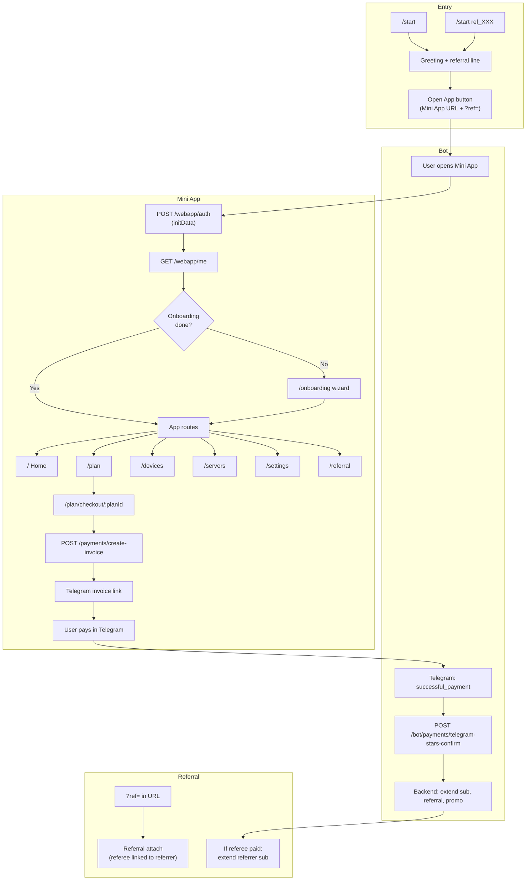

# Business Logic and User Journey Flows

**VPN Suite** — Full overview of business entities, user journeys, and end-to-end processes.

---

## 1. Core Business Entities

### Entity summary

| Entity | Key Fields | Relationships |
|--------|------------|---------------|
| **User** | `tg_id` (unique), `meta` (tg requisites, `preferred_server_id`, `server_auto_select`), `onboarding_step`, `onboarding_completed_at`, `onboarding_version` | subscriptions, devices, payments, referrals |
| **Plan** | `name`, `duration_days`, `price_amount`, `price_currency`, `upsell_methods` | subscriptions |
| **Subscription** | `user_id`, `plan_id`, `valid_from` / `valid_until`, `device_limit`, `status` (active / pending / cancelled / paused), `auto_renew`, `paused_at`, `is_trial`, `trial_ends_at` | user, plan, devices, payments |
| **Device** | `user_id`, `subscription_id`, `server_id`, `public_key`, `issued_at`, `revoked_at`, `apply_status` | user, subscription, server |
| **Server** | `name`, `region`, `api_endpoint`, `vpn_endpoint`, `status`, `is_active`, `max_connections`, `health_score` | devices, profiles |
| **Payment** | `user_id`, `subscription_id`, `provider` (e.g. telegram_stars), `status`, `amount`, `currency`, `external_id` (unique), `webhook_payload` | user, subscription |
| **Referral** | `referrer_user_id`, `referee_user_id`, `referral_code`, `status`, `reward_days`, `reward_applied_at` | referrer, referee (User) |
| **PromoCode** | `code`, `type` (e.g. bonus_days), `value`, `status`, `constraints` (expires_at, per_user_limit) | PromoRedemption |
| **PromoRedemption** | `promo_code_id`, `user_id`, `payment_id`, `subscription_id` | PromoCode, User, Payment |
| **ChurnSurvey** | `user_id`, `subscription_id`, `reason`, `discount_offered` | User, Subscription |

### Entity relationship (conceptual)

```
User ──┬──< Subscription ──< Plan
       ├──< Device ──> Server
       ├──< Payment
       ├──< Referral (as referrer or referee)
       └──< ChurnSurvey

Subscription ──< Device
Subscription ──< Payment
Payment ──< PaymentEvent
Referral: referrer_user_id → User, referee_user_id → User
```

---

## 2. User Journeys

### 2.1 Telegram Bot (thin entry)

The bot is the entry point; most product flows happen in the Mini App.

| Step | Trigger | Action |
|------|---------|--------|
| **Start** | User sends `/start` | Welcome message; backend `GET /bot/referral/my-link` for referral link; show "Open App" Web App button (URL = Mini App). |
| **Start with ref** | User sends `/start ref_XXX` | Same as above; Open App URL includes `?ref=XXX` for referral attribution (ref code = referrer user id). |
| **Payment** | Telegram sends `successful_payment` (Stars) to bot | Bot calls `POST /bot/payments/telegram-stars-confirm`; backend marks payment completed and applies effects; bot replies success or error. |

- **Auth:** Bot uses `X-API-Key` to call Admin API.
- **Menu:** Chat menu button can be set to Web App ("Open App").

### 2.2 Mini App (primary consumer UI)

**Bootstrap (before any route):**

1. Read Telegram WebApp `initData`.
2. `POST /webapp/auth` with `init_data` → validate Telegram HMAC → upsert User by `tg_id` → return `session_token` (JWT).
3. Store token; `GET /webapp/me` (Bearer) → user, subscriptions, devices, onboarding state.
4. Merge onboarding with local storage (resume).
5. Splash (short delay).
6. If onboarding not completed → redirect to `/onboarding`; else → show app routes.

**Onboarding (`/onboarding`):**

- 3-step outcome-based onboarding: (1) Install AmneziaVPN — choose device / store; (2) Get config — subscribe if needed → Devices → Issue device → copy or download .conf → in AmneziaVPN add configuration (import file or paste); (3) Confirm connected.
- Each step: `POST /webapp/onboarding/state` (step, completed, version).
- On complete: `completed: true` → then navigate to app (e.g. session `routing.recommended_route`).

**Main routes and data:**

| Route | Purpose | Key APIs |
|-------|---------|----------|
| **Home** `/` | Connection hero, quick actions, subscription summary | `/webapp/me`, `/webapp/plans`, `/webapp/servers`, `/webapp/usage`, health |
| **Plan** `/plan` | Current plan, tier carousel, usage, billing history, renewal toggle | `/webapp/me`, `/webapp/plans`, `/webapp/usage`, `/webapp/payments/history`, PATCH subscription (auto_renew) |
| **Checkout** `/plan/checkout/:planId` | Select plan, optional promo → pay with Telegram Stars | `/webapp/plans`, `POST /webapp/promo/validate`, `POST /webapp/payments/create-invoice`, `GET /webapp/payments/:id/status` (poll) |
| **Devices** `/devices` | List devices, issue config, revoke | `/webapp/me`, `POST /webapp/devices/issue`, `POST /webapp/devices/:id/revoke` |
| **Servers** `/servers` | List servers, select auto or specific server | `GET /webapp/servers`, `POST /webapp/servers/select` |
| **Settings** `/settings` | Account, pause/resume/cancel, revoke all, links | `/webapp/me`, `/webapp/subscription/offers`, pause/resume/cancel, revoke devices |
| **Referral** `/referral` | Share link, stats (earned days, active referrals) | `GET /webapp/referral/my-link`, `GET /webapp/referral/stats` |
| **Support** `/support` | Troubleshooter steps, FAQ, contact link | Session only |

**Navigation:** Bottom tabs (Home, Devices, Plan, Support, Account/Settings). Checkout, Referral, Servers are stack/full-screen (no tabs).

### 2.3 Admin (operator dashboard)

- **Auth:** `POST /auth/login` (email, password) → JWT; stored in sessionStorage; 401 triggers refresh or redirect to login.
- **Routes:** Dashboard, Servers, Users, Devices, Billing (subscriptions, payments), Audit, Telemetry, Control Plane, Settings.
- **Capabilities:** CRUD servers/users/devices/subscriptions/plans; issue device configs for users; peer block/reset/rotate; cluster resync; audit log; payment monitor (webhook errors); topology and automation.

See [ADMIN-PAGE-MAP.md](ADMIN-PAGE-MAP.md) for full UI and API map.

---

## 3. Key Business Flows

### 3.1 Authentication (WebApp)

```
Telegram WebApp (initData)
    → POST /webapp/auth { init_data }
    → Validate HMAC with bot token; extract tg user
    → Upsert User by tg_id; update meta["tg"]
    → Create JWT (type=webapp, sub=tg_id), TTL from settings
    → Return { session_token, expires_in }

Subsequent requests:
    → Authorization: Bearer <session_token>
    → GET /webapp/me → user, subscriptions, devices, onboarding, public_ip
```

### 3.2 Trial

- **Endpoint:** `POST /webapp/trial/start` (Bearer).
- **Rules:** One trial per user; requires trial plan in config and node runtime.
- **Effect:** Create active subscription (trial) + one device; set `trial_ends_at`.
- **Errors:** 409 if trial already used; 503 if trial plan or node unavailable.

### 3.3 Purchase (Telegram Stars)

```
1. Miniapp: POST /webapp/payments/create-invoice { plan_id, promo_code? }
   - Resolve user (Bearer), plan; lock user row
   - Find or create Subscription (user, plan): status active (if free) or pending
   - Idempotency: if recent pending payment for same user+sub → return it
   - Create Payment (pending, provider=telegram_stars, external_id, webhook_payload)
   - If free plan (0 Stars): set sub active, valid_until = now + duration_days
   - Call Telegram createInvoiceLink → invoice_link
   - Return { payment_id, invoice_link, star_count, subscription_id, free_activation? }

2. User opens invoice_link in Telegram and pays (Stars).

3. Telegram sends successful_payment to bot.
   - Bot: POST /bot/payments/telegram-stars-confirm { invoice_payload=payment_id, tg_id, ... }
   - Backend: find Payment by id, ensure user matches; idempotent complete.

4. Backend: complete_pending_payment_by_bot / process_payment_webhook
   - Set payment.status = completed
   - _apply_payment_success_effects:
     - Set subscription active; valid_until = base + plan.duration_days
     - Log funnel: payment, renewal
     - Referral: if Referral exists (referee_user_id = payer, reward_applied_at null),
       extend referrer's active sub by reward_days; set reward_applied_at, status=rewarded
     - Promo: if webhook_payload.promo_code, create PromoRedemption; if bonus_days, add to sub.valid_until
```

- **Webhook path:** Telegram can also send webhook to `POST /webhooks/payments/{provider}`; same `process_payment_webhook` and idempotency by `external_id`.

### 3.4 Device issuance

```
POST /webapp/devices/issue (Bearer)
  - Resolve user; rate limit per user (Redis)
  - Require active subscription (status=active, valid_until > now)
  - TopologyEngine: preferred_server_id from user.meta or auto-select (load/health)
  - issue_device(): create Device, add peer on VPN node, build config (awg, wg_obf, wg)
  - Persist issued configs; invalidate device caches
  - Background: send config text + .conf file to user's Telegram chat
  - Return device_id, config variants, node_mode, peer_created
```

- **Errors:** 400 no active subscription; 409 server not synced; 502/503 node/peer errors; 429 rate limit.

### 3.5 Referral reward (on referee payment)

- **Attach:** Referrer’s link is `ref_<user_id>`. When a new user opens with `?ref=XXX`, attribution is recorded via `POST /webapp/referral/attach` (Bearer) with `referral_code`; backend creates `Referral(referrer_user_id, referee_user_id, status=pending)`. Frontend uses a [cascade capture and sessionStorage](referral-pipeline.md) so ref survives router/Telegram URL changes; backend returns status `attached` | `already_attached` | `self_referral_blocked` | `invalid_ref`.
- **Reward:** When the referee’s payment is completed, `_apply_payment_success_effects` finds a `Referral` with that `referee_user_id` and `reward_applied_at IS NULL`. If referrer has an active subscription, extend `valid_until` by `reward_days` (e.g. 7). Set `reward_applied_at`, `status=rewarded`. Log funnel `referral_signup`.

### 3.6 Retention (pause / resume / cancel)

| Action | Endpoint | Effect |
|--------|----------|--------|
| **Pause** | `POST /webapp/subscription/pause` | retention_service.pause_subscription: set `paused_at` (subscription remains, access suspended until resume). |
| **Resume** | `POST /webapp/subscription/resume` | Clear `paused_at`. |
| **Cancel** | `POST /webapp/subscription/cancel` { subscription_id?, reason_code, discount_accepted? } | Create ChurnSurvey; set subscription `status=cancelled`. Log funnel `cancel_confirm`. |

- **Offers:** `GET /webapp/subscription/offers` returns current sub, `can_pause`, `can_resume`, retention discount info.

---

## 4. Funnel Events and Telemetry

**Funnel events (DB):** `log_funnel_event(db, event_type, user_id, payload)`.

| Event | When |
|-------|------|
| `dashboard_open` | GET /webapp/me (source=webapp) |
| `pricing_view` | GET /webapp/plans |
| `plan_selected` | POST /webapp/payments/create-invoice |
| `payment` | Payment success effects |
| `renewal` | Payment success effects |
| `cancel_click` | GET /webapp/subscription/offers |
| `cancel_confirm` | POST /webapp/subscription/cancel |
| `server_change` | POST /webapp/servers/select |
| `referral_signup` | Referral reward applied |
| `promo_applied` | Promo redemption in payment success |

**Prometheus:** `miniapp_events_total{event=...}`, `vpn_revenue_payment_total`, `vpn_revenue_renewal_total`, `vpn_revenue_referral_paid_total`, `payment_webhook_total{status=received|processed|failed}`.

**Frontend:** POST /webapp/telemetry for screen_open, cta_click, web_vital, etc.

---

## 5. Data Flow Diagram



---

## 6. Spec alignment

**Source of truth:** [vpn-suite-specs/docs/product/VPN-SUITE-BUSINESS-LOGIC-USERFLOWS-SPEC-V2.md](../vpn-suite-specs/docs/product/VPN-SUITE-BUSINESS-LOGIC-USERFLOWS-SPEC-V2.md) and [GROWTH-MONETIZATION-SPEC.md](../vpn-suite-specs/docs/product/GROWTH-MONETIZATION-SPEC.md).

### §16 Acceptance checklist

- [x] Subscription state split (commercial, access, billing, renewal)
- [x] Grace with explicit `grace_until`; grace-on-expiry worker when `GRACE_WINDOW_HOURS` > 0
- [x] State-driven first-run routing (`recommended_route` in `/webapp/me`)
- [x] Onboarding outcome-based (3 steps: choose device, get config, confirm connected)
- [x] Checkout confirmation layer before invoice open
- [x] Device slot replacement and connection-centric actions (APIs + Devices UX)
- [x] Cancellation reason-aware and offer-driven (`reason_group` → `GET /subscription/offers`)
- [x] Referral rewards accrue without active referrer sub (`pending_reward_days`)
- [x] Payment and entitlement event ledgers
- [x] Telemetry: onboarding, invoice, connection, retention events

### First device after payment

Spec §8.3: "issue first device immediately". Implemented via **routing**: after payment success, `GET /webapp/me` returns `recommended_route: "/devices/issue"` (subscription exists, no device), so the user lands on the issue flow in one step. Optional future: backend auto-issue in payment webhook (would require worker or injected runtime adapter).

### Backfill and ops

- **Subscription state backfill:** `python -m scripts.backfill_subscription_state` (from `backend/`).
- **Admin:** Billing → Subscription records show subscription_status, access_status, grace; Set/Clear grace; Entitlement events and Cancellation reasons tabs.

---

## 7. References

- [Referral pipeline (production)](referral-pipeline.md) — Capture cascade, attach API contract, backend rules, observability
- [backend/app/api/v1/webapp.py](../backend/app/api/v1/webapp.py) — WebApp auth, me, onboarding, plans, devices, payments, servers, referral, subscription, trial
- [backend/app/services/payment_webhook_service.py](../backend/app/services/payment_webhook_service.py) — Payment completion, referral reward, promo redemption
- [bot/handlers/start.py](../bot/handlers/start.py), [bot/handlers/payment.py](../bot/handlers/payment.py) — Bot /start and successful_payment
- [docs/revenue-engine-funnel.md](revenue-engine-funnel.md) — Funnel flow and copy
- [docs/MINIAPP_SPEC.md](MINIAPP_SPEC.md) — Mini App screens, data flow, telemetry
- [docs/ADMIN-PAGE-MAP.md](ADMIN-PAGE-MAP.md) — Admin routes, layout, API list
