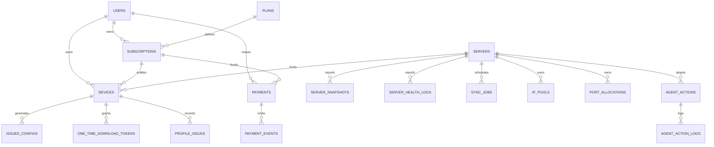

# DB Schema Spec

Repository-aligned schema summary derived from current SQLAlchemy models and Alembic migrations.

## Schema groups

| Group | Tables | Purpose |
|-------|--------|---------|
| Auth and audit | `roles`, `admin_users`, `audit_logs` | Admin auth, RBAC, audit trail |
| User and billing | `users`, `plans`, `plan_bandwidth_policies`, `subscriptions`, `payments`, `payment_events`, `price_history` | Commercial state and entitlements |
| Growth and analytics | `promo_codes`, `promo_redemptions`, `referrals`, `funnel_events`, `entitlement_events`, churn-related tables | Promo/referral lifecycle and revenue signals |
| Node registry and telemetry | `servers`, `server_profiles`, `server_ips`, `server_health_logs`, `server_snapshots`, `sync_jobs`, `latency_probes`, `docker_alerts` | Execution-node inventory and health history |
| Network control-plane | `ip_pools`, `port_allocations` | Address and port allocation state |
| Device and config lifecycle | `devices`, `issued_configs`, `profile_issues`, `one_time_download_tokens` | Issuance, download, and runtime apply state |
| Action orchestration | `agent_actions`, `agent_action_logs`, `control_plane_events` | Queued operations and operator-visible history |

## Core lifecycle entities

### Servers

Source file: `apps/admin-api/app/models/server.py`

Important fields already present:

- Identity: `id`, `name`, `region`
- Runtime addressing: `api_endpoint`, `vpn_endpoint`
- Crypto/runtime sync: `public_key`, `preshared_key`, `public_key_synced_at`, `key_status`
- Capacity and policy: `traffic_limit_gb`, `speed_limit_mbps`, `max_connections`
- Health and scheduling: `status`, `health_score`, `is_active`, `is_draining`
- Sync/ops: `last_snapshot_at`, `auto_sync_enabled`, `auto_sync_interval_sec`, `ops_notes`

Relationships:

- One-to-many with server profiles, health logs, IP pools, port allocations, issued configs, snapshots, sync jobs, server IPs, agent actions, and devices.

### Devices

Source file: `apps/admin-api/app/models/device.py`

Important fields already present:

- Ownership: `user_id`, `subscription_id`, `server_id`
- Identity and config: `device_name`, `platform`, `public_key`, `allowed_ips`, `config_amnezia_hash`, `preshared_key`
- Lifecycle: `issued_at`, `revoked_at`, `suspended_at`, `expires_at`
- Runtime convergence: `apply_status`, `last_applied_at`, `last_seen_handshake_at`, `last_connection_confirmed_at`, `last_error`
- Profile behavior: `protocol_version`, `obfuscation_profile`, `unstable_reason`, `connection_profile`

Relationships:

- Belongs to user, subscription, and server.
- Has many profile issues, issued configs, and one-time download tokens.

### Agent actions

Source file: `apps/admin-api/app/models/agent_action.py`

Important fields already present:

- Targeting: `server_id`, `type`, `payload`
- Lifecycle: `status`, `requested_at`, `started_at`, `finished_at`, `error`
- Traceability: `requested_by`, `correlation_id`

Relationships:

- Belongs to a server.
- Has many action logs.

## Commercial and identity entities

### Users and subscriptions

- `users` owns the customer record and user state.
- `subscriptions` links user to plan, commercial term, and status.
- `devices` hang off subscription and user, not just server.
- `payments` and `payment_events` provide billing ingress history.

### Promotions and referrals

- `promo_codes`, `promo_redemptions`, and `referrals` are first-class entities.
- Growth, churn, and entitlement signals already exist and should be treated as part of the as-built product, not a future add-on.

## Network control-plane entities

### IP pools

- Pool ownership attaches to `servers`.
- Pool lifecycle is already explicit and should be used by placement/reconciliation specs.

### Port allocations

- Port allocation is persisted rather than inferred.
- This means placement and failover specs must treat it as explicit state with drift potential.

## Config delivery entities

### Issued configs

- Stores encrypted config content and tokenized download metadata.
- Supports multiple profile types and one-time delivery semantics.

### One-time download tokens

Source file: `apps/admin-api/app/models/one_time_download.py`

Important fields:

- `token_hash`
- `device_id`
- `kind`
- `expires_at`
- `consumed_at`

The public token is never stored in plaintext; only its hash persists.

## Entity relationship summary

## Schema implications for implementation

- Servers are operational state holders, not metadata-only rows.
- Devices are runtime convergence objects, not just issued config metadata.
- Tokenized delivery is part of the persisted lifecycle.
- Scheduling inputs already exist in the schema: health, drain state, pools, and capacity fields.
- Action orchestration already has persistence primitives and should be formalized instead of reinvented.
