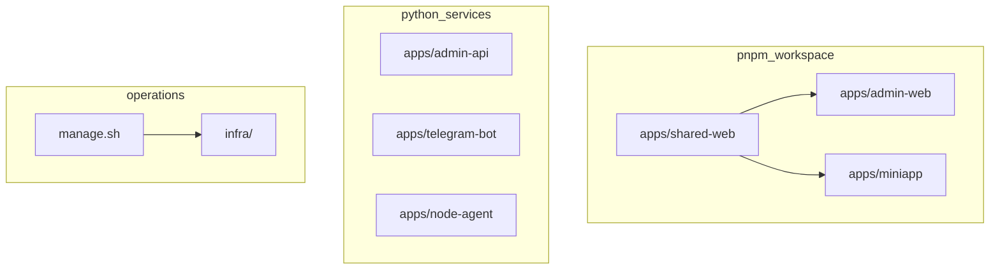

# VPN Suite — Codebase Map

Precise map of the repository structure, entry points, and responsibilities.

---

## Monorepo boundaries

Everything under `apps/` looks similar in the tree, but only three packages are part of the **pnpm workspace** ([`pnpm-workspace.yaml`](../pnpm-workspace.yaml)). Root scripts in [`package.json`](../package.json) (`pnpm run lint`, `typecheck`, `test`, `build`) apply to those packages only.

| Boundary | Paths | Tooling |
|----------|--------|---------|
| **pnpm workspace** | `apps/admin-web`, `apps/miniapp`, `apps/shared-web` | Node, pnpm, ESLint/TS from repo root (miniapp may extend config locally) |
| **Not in pnpm** | `apps/admin-api`, `apps/telegram-bot`, `apps/node-agent` | Python 3.12 per app (`pyproject.toml`, venv), tests via pytest; run and compose via [`manage.sh`](../manage.sh) / Docker |

Shared TypeScript types and utilities ship as **`@vpn-suite/shared`** ([`apps/shared-web/package.json`](../apps/shared-web/package.json)); both admin and miniapp depend on it. HTTP API contracts are also published as OpenAPI at [`openapi/openapi.yaml`](../openapi/openapi.yaml) (`./manage.sh openapi`).

---

## 1. Root

| File / Dir           | Purpose                                                                                                                                                                                                               |
| -------------------- | --------------------------------------------------------------------------------------------------------------------------------------------------------------------------------------------------------------------- |
| `manage.sh`          | Ops CLI: `up-core`, `up-api`, `up-monitoring`, `down-core`, `bootstrap`, `up-agent`, `migrate`, `seed*`, `check`, `verify`, `smoke-staging`, `config`, `config-validate`, `build*`, `backup-db`, `restore-db`, `node-*`, `server:verify`, `server:sync`, `server:reconcile`, `device:reissue`, `support-bundle`, `ps`, `logs`. See README.md and [docs/ops/runbook.md](ops/runbook.md). |
| `infra/compose/docker-compose.yml` | Services: admin-api, reverse-proxy, postgres, redis, telegram-vpn-bot; profile `monitoring`: prometheus, cadvisor, node-exporter, loki, promtail, grafana                                                             |
| `.env.example`       | Env template; copy to `.env` (single source of truth); manage.sh uses `.env` unless `ENV_FILE` set                                                                                                                    |
| `AGENTS.md`          | Architecture, constraints, API contract, AmneziaWG/WireGuard control channel                                                                                                                                          |
| `README.md`          | Quick start, key commands, stack summary                                                                                                                                                                              |

### 1.2 Service inventory (high-level)

| Service | Path | Language | Purpose |
|---------|------|----------|---------|
| admin-api | apps/admin-api/ | Python 3.12 / FastAPI | Control-plane REST API, auth, device issue/revoke, telemetry, payments |
| admin-frontend | apps/admin-web/ | TypeScript / React / Vite | Admin SPA — devices, servers, users, telemetry, billing |
| miniapp | apps/miniapp/ | TypeScript / React | Telegram Mini App — subscription & device management |
| telegram-vpn-bot | apps/telegram-bot/ | Python / aiogram 3 | Telegram bot — user self-service, webhooks |
| node-agent | apps/node-agent/ | Python 3.12 | WireGuard/AmneziaWG node reconciler |
| reverse-proxy | infra/proxy/reverse-proxy/ | Caddy | TLS termination, static frontends, mTLS for agent |

### 1.3 Operations (agent-only ownership, key verification, support)

- **Production:** Must use `NODE_DISCOVERY=agent`; only node-agent mutates WireGuard/AmneziaWG peers. Control-plane with docker discovery refuses to start when `ENVIRONMENT=production`.
- **Key verification:** Issuance and reissue use live server key from node/heartbeat; block with 409 `SERVER_NOT_SYNCED` if key unknown. Run `./manage.sh server:sync <server_id>` to sync key to DB.
- **Reconcile:** In agent mode, node-agent pulls desired state and reconciles; in docker mode use `./manage.sh server:reconcile <server_id>` or `node-resync`.
- **Support bundle:** `./manage.sh support-bundle [--output DIR]` collects bounded logs, Redis agent keys, manifest. Audit events: `GET /api/v1/audit?limit=N`.

---

## 2. Backend (`apps/admin-api/`)

**Entry:** `app/main.py` — FastAPI app, lifespan (redis, node runtime, background loops), routers mounted under `/api/v1` (except webhooks).

### 2.1 API routers (`app/api/v1/`)

| Router                | Prefix         | Role                                     |
| --------------------- | -------------- | ---------------------------------------- |
| `auth.py`             | /api/v1        | Login, TOTP, session                     |
| `log.py`              | /api/v1        | Log endpoints                            |
| `overview.py`         | /api/v1        | Overview/dashboard data                  |
| `audit.py`            | /api/v1        | Audit log query                          |
| `cluster.py`          | /api/v1        | /cluster/topology, nodes, health, resync |
| `control_plane.py`    | /api/v1        | Control-plane automation resources       |
| `peers.py`            | /api/v1        | WG peer CRUD                             |
| `wg.py`               | /api/v1        | WG provisioning (e.g. POST /wg/peer)     |
| `servers.py`          | /api/v1        | Servers CRUD                             |
| `servers_peers.py`    | /api/v1        | Servers ↔ peers                          |
| `servers_stream.py`   | /api/v1        | Servers SSE stream                       |
| `admin_configs.py`    | /api/v1        | Admin configs                            |
| `users.py`            | /api/v1        | Users                                    |
| `devices.py`          | /api/v1        | Devices                                  |
| `plans.py`            | /api/v1        | Plans                                    |
| `subscriptions.py`    | /api/v1        | Subscriptions                            |
| `agent.py`            | /api/v1        | Node-agent registration/heartbeat        |
| `telemetry_docker.py` | /api/v1 + /api | Docker telemetry                         |
| `payments.py`         | /api/v1        | Payments                                 |
| `webhooks.py`         | (root)         | /webhooks/payments/{provider} (no JWT)   |
| `bot.py`              | /api/v1        | Bot-facing API                           |
| `webapp.py`           | /api/v1        | Webapp/miniapp API                       |

### 2.2 Core (`app/core/`)

| Module                             | Role                                                       |
| ---------------------------------- | ---------------------------------------------------------- |
| `config.py`                        | Settings (env)                                             |
| `database.py`                      | Postgres engine, session, check_db                         |
| `redis_client.py`                  | Redis init/check/close                                     |
| `security.py`                      | Hashing, JWT                                               |
| `rbac.py`                          | Role-based access                                          |
| `bot_auth.py`                      | Bot auth                                                   |
| `rate_limit.py`                    | Rate limiting                                              |
| `exceptions.py`                    | Domain exceptions                                          |
| `error_responses.py`               | Unified error body                                         |
| `redaction.py`                     | Log redaction                                              |
| `audit_middleware.py`              | Audit logging                                              |
| `request_logging_middleware.py`    | Request logging                                            |
| `prometheus_middleware.py`         | Metrics                                                    |
| `logging_config.py`                | Logging setup                                              |
| `amnezia_config.py`                | Amnezia client config (Jc, Jmin, Jmax, S1, S2, H1–H4, mtu) |
| `metrics.py`                       | Prometheus metrics                                         |
| `node_scan_task.py`                | Node discovery loop (docker ps → wg show)                  |
| `server_sync_loop.py`              | Server sync loop                                           |
| `health_check_task.py`             | Health check loop                                          |
| `limits_check_task.py`             | Limits check loop                                          |
| `telemetry_polling_task.py`        | Telemetry poll loop                                        |
| `docker_alert_polling_task.py`     | Docker alert poll loop                                     |
| `control_plane_automation_task.py` | Control-plane automation                                   |

### 2.3 Services (`app/services/`)

| Service                       | Role                                      |
| ----------------------------- | ----------------------------------------- |
| `node_runtime.py`             | Abstract node runtime interface           |
| `node_runtime_docker.py`      | Docker exec adapter (amnezia-awg, wg/awg) |
| `node_runtime_agent.py`       | Agent-mode adapter (no docker exec)       |
| `docker_engine_client.py`     | Docker API client                         |
| `topology_engine.py`          | Topology map, reconciliation              |
| `control_plane_service.py`    | Control-plane ops                         |
| `reconciliation_engine.py`    | Reconcile DB ↔ runtime                    |
| `load_balancer.py`            | Node selection for new peers              |
| `server_health_service.py`    | Server health                             |
| `server_sync_service.py`      | Server sync                               |
| `health_scoring.py`           | Health scores                             |
| `admin_issue_service.py`      | Issue config (Amnezia/WG)                 |
| `issue_service.py`            | Issue service abstraction                 |
| `migrate_service.py`          | Migration helpers                         |
| `limits_check_service.py`     | Limits checks                             |
| `docker_telemetry_service.py` | Docker telemetry                          |
| `docker_logs_service.py`      | Docker logs                               |
| `docker_alert_rule_engine.py` | Alert rules                               |
| `prometheus_query_service.py` | Prometheus queries                        |
| `audit_service.py`            | Audit persistence                         |
| `payment_webhook_service.py`  | Payment webhooks                          |
| `funnel_service.py`           | Funnel events                             |

### 2.4 Models (`app/models/`)

| Model                                                                                          | Role                     |
| ---------------------------------------------------------------------------------------------- | ------------------------ |
| `base.py`                                                                                      | SQLAlchemy base          |
| `role.py`, `admin_user.py`                                                                     | Auth                     |
| `user.py`                                                                                      | User                     |
| `server.py`, `server_ip.py`, `server_profile.py`, `server_health_log.py`, `server_snapshot.py` | Servers                  |
| `sync_job.py`                                                                                  | Sync jobs                |
| `device.py`, `issued_config.py`, `profile_issue.py`                                            | Devices / configs        |
| `plan.py`, `plan_bandwidth_policy.py`                                                          | Plans                    |
| `subscription.py`, `payment.py`                                                                | Subscriptions / payments |
| `promo_code.py`, `promo_redemption.py`, `referral.py`                                          | Promo / referrals        |
| `audit_log.py`                                                                                 | Audit                    |
| `control_plane_event.py`                                                                       | Control-plane events     |
| `docker_alert.py`                                                                              | Docker alerts            |
| `funnel_event.py`                                                                              | Funnel                   |
| `latency_probe.py`                                                                             | Latency                  |
| `port_allocation.py`, `ip_pool.py`                                                             | Networking               |

### 2.5 Schemas (`app/schemas/`)

Pydantic schemas for API: `auth`, `user`, `server`, `server_ip`, `device`, `plan`, `subscription`, `payment`, `audit`, `control_plane`, `node`, `agent`, `bot`, `docker_telemetry`, `snapshot`, `payment`, etc.

### 2.6 DB migrations

`alembic/` — `versions/` contains 001–028 (roles, servers, users, plans, subscriptions, devices, referrals, funnel, health, control_plane, docker_alerts, snapshots, sync_jobs, server_ips, audit, etc.).

### 2.7 Scripts (`apps/admin-api/scripts/`)

| Script                    | Role                      |
| ------------------------- | ------------------------- |
| `seed_admin.py`           | Bootstrap admin user      |
| `seed_plans.py`           | Optional: seed plans from env (PLAN_*); plans normally in Admin UI & DB |
| `seed_servers.py`         | Seed servers (nodes)      |
| `seed_agent_server.py`    | One server for agent mode |
| `seed_system_operator.py` | System operator user      |
| `node_ops.py`             | Node operations           |
| `export_openapi.py`       | Export OpenAPI            |

### 2.8 Tests

`tests/` — pytest: e.g. `test_servers_api.py`, `test_control_plane_logic.py`, `test_amnezia_config.py`, `test_server_sync_loop.py`, `test_servers_peers_api.py`, `test_servers_stream_api.py`, etc.

---

## 3. Frontend

### 3.1 Shared (`apps/shared-web/`)

- **Types:** `admin-api.ts`, `api-error.ts`, `webapp.ts`, `index.ts`
- **API client:** `api-client/create-client.ts`, `get-base-url.ts`
- **UI:** `ui/` — Button, Card, Modal, Drawer, Table, Input, Select, Badge, Skeleton, Toast, PageError, SearchInput, Checkbox, StatusIndicator, ServerHealthBadge, DeviceCard, ProfileCard, ConnectButton, EmptyState, etc.
- **Theme:** `theme/ThemeProvider.tsx`, `index.ts`
- **Styles:** `layout.css`, `utilities.css`
- **Build:** `scripts/build-tokens.js`

### 3.2 Admin app (`apps/admin-web/`)

- **Entry:** `main.tsx` → `App.tsx` (basename `/admin`)
- **Routes:** `/login`; under layout: `/` (Dashboard), `/telemetry`, `/automation` (Control Plane), `/servers`, `/servers/new`, `/servers/:id`, `/servers/:id/edit`, `/users`, `/users/:id`, `/billing` (tabs: subscriptions, payments), `/subscriptions`→`/billing?tab=subscriptions`, `/payments`→`/billing?tab=payments`, `/devices`, `/audit`, `/settings`, `/styleguide`
- **Pages:** `Dashboard`, `Telemetry`, `ControlPlane`, `Servers`, `ServerNew`, `ServerEdit`, `ServerDetail`, `Users`, `UserDetail`, `Subscriptions`, `Devices`, `Payments`, `Audit`, `Settings`, `Login`, `Styleguide`; telemetry: `LogsViewer`, `ContainerDetailsPanel`, `DockerServicesTab`, `VpnNodesTab`, `DockerOverviewTable`, `AlertsPanel`
- **Layout:** `AdminLayout.tsx`
- **Components:** `Toolbar`, `PageHeader`, `Breadcrumb`, `FormField`, `TableSection`, `ChartSection`, `MetricCard`, `StatusBadge`, `ServerRowDrawer`, `ErrorBoundary`, `ProtectedRoute`, `CommandPalette`, `IssueConfigModal`, `ChartFrame`, `EChart`, etc.
- **Charts:** `charts/` — timeseries, presets (opsSparkline, opsTimeseries), theme, format, telemetry (CpuPct, MemoryBytes, NetRate, DiskRate, ErrorsPerMinute)
- **Hooks:** `useServerList.ts`, `useServersStream.ts`, `useDockerTelemetry.ts`
- **API:** `api/client.ts`, `query-keys.ts`
- **Store:** `authStore.ts`
- **E2E:** `e2e/` — specs (e.g. `release-smoke.spec.ts`, `servers-users.spec.ts`), `helpers.ts`

### 3.3 Miniapp (`apps/miniapp/`)

- **Entry:** `main.tsx` → `App.tsx` (basename `/webapp`)
- **Routes:** `/` (Home), `/devices`, `/profile`, `/help` (under MiniappLayout); `/plans`, `/checkout/:planId`, `/referral`
- **Pages:** `Home`, `Plans`, `Checkout`, `Devices`, `Profile`, `Referral`, `Help`
- **Layout:** `MiniappLayout.tsx`
- **Components:** `AuthGuard.tsx`
- **Hooks:** `useTelegramWebApp.ts`, `useSession.ts`
- **API:** `api/client.ts`
- **E2E:** `e2e/checkout.spec.ts`, playwright config

### 3.4 Build

- Root `package.json` — frontend workspace (admin, miniapp, shared); scripts: lint, typecheck, test, build, test:e2e
- Admin/miniapp: Vite 6, React 18, TypeScript, TanStack Query 5

---

## 4. Bot (`apps/telegram-bot/`)

- **Entry:** `main.py` — aiogram app, /healthz on 8090, PANEL_URL → admin-api
- **Config:** `config.py`
- **Handlers:** `start.py`, `tariffs.py`, `status.py`, `install.py`, `devices.py`, `help.py`, `support.py`, `nav.py`, `menu_actions.py`, `fallback.py`
- **Keyboards:** `keyboards/common.py`
- **Utils:** `messages.py`, `errors.py`, `formatting.py`, `logging.py`, `config_validator.py`, `safe_send.py`
- **API:** `api_client.py` — calls admin-api (no WG direct)
- **i18n:** `i18n.py`
- **Middleware:** `middleware/logging.py`
- **Tests:** `tests/` — test_handlers, test_api_client, test_config, test_keyboards, conftest

---

## 5. Node-agent (`apps/node-agent/`)

- **Entry:** `agent.py` — heartbeat/registration to admin-api (agent mode; no docker exec from control-plane)
- **Build:** `Dockerfile`, `requirements.txt`
- **Proto:** See `proto/node_agent.proto` for contract

---

## 6. Config (`config/`)

| Path                                                           | Role                                                              |
| -------------------------------------------------------------- | ----------------------------------------------------------------- |
| `caddy/Caddyfile`                                              | Reverse proxy: /admin, /webapp, /api, /health; agent mTLS if used |
| `caddy/Caddyfile.audit`, `caddy/root/index.html`               | Audit / root                                                      |
| `monitoring/prometheus.yml`                                    | Prometheus scrape                                                 |
| `monitoring/alert_rules.yml`                                   | Alerts                                                            |
| `monitoring/loki-config.yml`, `monitoring/promtail-config.yml` | Logs                                                              |
| `logrotate-vpn-suite`                                          | Logrotate                                                         |
| `cron-vpn-suite-backup`, `cron-vpn-suite-optimize`             | Cron configs                                                      |

---

## 7. Scripts (`scripts/`)

| Script                                               | Role                                                                                                          |
| ---------------------------------------------------- | ------------------------------------------------------------------------------------------------------------- |
| `verify.sh`                                          | Full quality gate (ruff, alembic, pytest, bot pytest, frontend ci/lint/typecheck/test/build, config-validate) |
| `quality_gate.sh`                                    | Quality gate                                                                                                  |
| `staging_full_validation.sh`                         | E2E staging                                                                                                   |
| `staging_ha_failover_smoke.sh`                       | HA smoke                                                                                                      |
| `backup-postgres-redis.sh`                           | Backup DB/Redis                                                                                               |
| `release_api_happy_path.sh`                          | API happy path                                                                                                |
| `zero_failure_audit.sh`, `zero_failure_api_audit.py` | Audits                                                                                                        |
| `optimize-resources.sh`                              | Resource tuning                                                                                               |
| `kill-amnezia-wg-no-peers.sh`                        | Cleanup                                                                                                       |
| `apps/admin-api/scripts/test_stand_vpn_config.py` | VPN config validation                                                                                               |
| `lib/env.sh`                                         | Env helpers                                                                                                   |

---

## 8. Infra Ops (`infra/`)

| Path                                            | Role                 |
| ----------------------------------------------- | -------------------- |
| `bootstrap-prod.sh`                             | Prod bootstrap       |
| `harden-secrets.sh`, `ufw-remove-8000.sh`, `block-metadata-endpoints.sh` | Hardening |
| `setup-fail2ban.sh`, `sysctl-hardening.conf`    | Host hardening       |
| `db_dump.sh`, `db_restore.sh`                   | DB dump/restore      |
| `rotate-agent-token.sh`                         | Agent token rotation |
| `restart-core-stack.sh`                         | Restart stack        |
| `systemd/vpn-suite-backup-db.service`, `.timer` | Backup systemd       |
| `pki/agent-mtls.sh`                             | Agent mTLS PKI       |

---

## 9. Proto / OpenAPI

| Path                     | Role                                  |
| ------------------------ | ------------------------------------- |
| `proto/node_agent.proto` | Node-agent protocol                   |
| `openapi/openapi.yaml`, `openapi/openapi.json` | Admin API OpenAPI spec (`./manage.sh openapi`) |

---

## 10. CI / GitHub

`.github/workflows/ci.yml` — Backend: ruff, pytest, alembic; frontend: pnpm install --frozen-lockfile, audit, lint, typecheck, test, build; docker build; gitleaks; frontend E2E (postgres, redis, uvicorn, seed_admin, dev:admin, test:e2e).

---

## 11. Docs

| Doc                                                               | Role                          |
| ----------------------------------------------------------------- | ----------------------------- |
| `docs/README.md`                                                  | Docs index                    |
| `docs/audits/release-readiness-report.md`                         | Audit, scores, commands       |
| `docs/ops/runbook.md`                                             | Ops, troubleshooting, backups |
| `docs/ops/quality-gates.md`                                       | Quality gates                 |
| api/, ops/, security/, specs/, backlog/, audits/, frontend/, guides/ | See docs/README.md |

---

## 12. Data flow (summary)

- **Telegram bot** → Admin API only (provisioning, users, plans, payments, webhooks). Redis: FSM, rate limit, queues.
- **Admin UI** → Admin API (auth, cluster, servers, users, devices, subscriptions, payments, audit, telemetry).
- **Miniapp** → Admin API (webapp endpoints: plans, checkout, devices, profile, referral).
- **Control plane** → Docker: `docker exec <amnezia-awg*> wg show` / `wg set`; or node-agent heartbeat when in agent mode. Postgres = source of truth; reconciliation loop keeps runtime and DB in sync.
