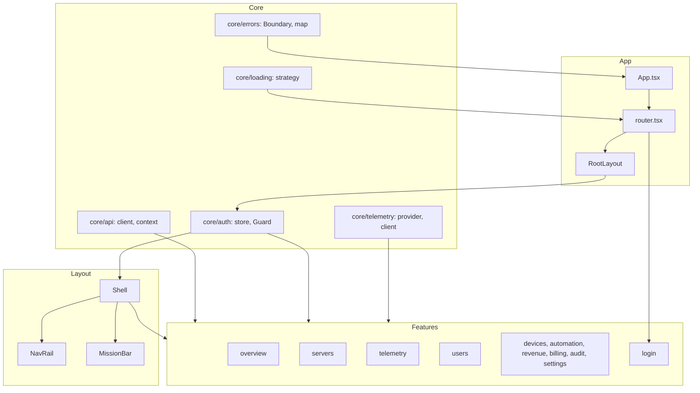

# Admin Dashboard Architecture (Zero-Ground Rebuild)

## Overview

Single shell layout, one API abstraction, centralized state. All features use the same core: API client, auth store, telemetry provider, error boundary, and loading strategy.

## Architecture Diagram



## Data Flow

- **API/Telemetry → Store/Query → Features:** All server data goes through `core/api` (createApiClient + ApiProvider). TanStack Query holds server state; auth and app UI state live in Zustand (core/auth/store). Telemetry is provided by core/telemetry and consumed via useTelemetry().
- **Layout:** RootLayout wraps Guard + Shell. Shell renders NavRail, MissionBar, and Outlet. No layout logic in feature pages.

## State Ownership Map

| State | Owner | Location | Consumed by |
|-------|--------|----------|-------------|
| accessToken, refreshToken, logout, setTokens | Zustand | core/auth/store.ts | Guard, API client (getToken), features (useAuthStore) |
| API client instance | React Context | core/api/context.tsx (provided in main) | features via useApi() |
| Server state (lists, details, etc.) | TanStack Query | queryClient in main | features via useQuery/useMutation |
| Live telemetry (cluster, connection state) | React Context | core/telemetry/provider.tsx | features via useTelemetry() |
| Theme, density, sidebar (future) | Zustand or context | TBD | layout, features |
| Route-level loading | Suspense | app/router.tsx | RouteFallback (Skeleton) |
| Error boundary state | React class state | core/errors/Boundary.tsx | Renders on componentDidCatch |

- **No prop-drilling:** Auth and API are accessed via hooks (useAuthStore, useApi, useTelemetry). Dashboard settings and app-level UI state will live in a single store or context slice.

## File Tree (Target)

```
src/
├── app/           # App.tsx, router.tsx, RootLayout.tsx
├── core/          # api, auth, telemetry, errors, loading
├── design-system/ # tokens, primitives (Skeleton), index
├── features/      # overview, servers, telemetry, users, devices, automation, revenue, billing, audit, settings, login
├── layout/        # Shell, NavRail, MissionBar
└── shared/        # constants, types (api-error only)
```

## Key Contracts

- **API:** One client from createApiClient(); baseUrl, getToken, onUnauthorized, timeoutMs. All features use useApi() or pass client to TanStack Query.
- **Auth:** useAuthStore() for tokens and logout. Guard redirects to /login when no accessToken.
- **Errors:** ErrorBoundary catches render errors; mapApiErrorToAppError() maps API errors to user-facing messages. No silent catches.
- **Loading:** Route-level lazy + Suspense; one Skeleton fallback per segment.
