# Admin UI Gap Analysis + Missing Primitives Spec

Repo-grounded inventory, "what exists vs what should exist" matrix, missing primitives/domain components with typed APIs, dependency graph, and 8–15 PR migration plan.

---

## 1. Admin routes and pages (source of truth)

Routes defined in `frontend/admin/src/app/router.tsx` (rendered by `frontend/admin/src/App.tsx`).

| Route | Page file | Major UI blocks |
|-------|-----------|-----------------|
| `/login` | `frontend/admin/src/features/login/LoginPage.tsx` | Auth form |
| `/` (Overview) | `frontend/admin/src/features/overview/OverviewPage.tsx` | Operator overview widgets |
| `/servers` | `frontend/admin/src/features/servers/ServersPage.tsx` | Servers snapshot summary + actions |
| `/telemetry` | `frontend/admin/src/features/telemetry/TelemetryPage.tsx` | Telemetry snapshot + docker containers/alerts |
| `/users` | `frontend/admin/src/features/users/UsersPage.tsx` | Users list + actions |
| `/devices` | `frontend/admin/src/features/devices/DevicesPage.tsx` | Devices list + reissue flows |
| `/automation` | `frontend/admin/src/features/automation/AutomationPage.tsx` | Control-plane automation UI |
| `/revenue` | `frontend/admin/src/features/revenue/RevenuePage.tsx` | Revenue/operator panels |
| `/billing` | `frontend/admin/src/features/billing/BillingPage.tsx` | Billing tabs |
| `/audit` | `frontend/admin/src/features/audit/AuditPage.tsx` | Audit list |
| `/settings` | `frontend/admin/src/features/settings/SettingsPage.tsx` | Settings |
| `/styleguide` | `frontend/admin/src/features/styleguide/StyleguidePage.tsx` | Design-system demo |

Layout/root shell: `frontend/admin/src/app/RootLayout.tsx` → `frontend/admin/src/layout/DashboardShell.tsx`.

**Note (2026-03):** The remainder of this document references a pre-refactor file layout (`pages/`, `components/`, `frontend/shared/*`). Treat those references as legacy unless updated elsewhere.

---

## 2. Admin design-system primitive inventory (current)

**Source of truth:**

- Primitives: `frontend/admin/src/design-system/primitives/`
- Typography: `frontend/admin/src/design-system/typography.tsx`
- Tokens: `frontend/admin/src/design-system/tokens/tokens.css`

Older references to `frontend/shared/src/ui/*` in historical docs are legacy and should be treated as removed/migrated.

---

## 3. Admin-only component inventory (usage counts)

| Component | Location | Used in (files) | Pattern |
|-----------|----------|-----------------|---------|
| PageHeader | `frontend/admin/src/components/PageHeader.tsx` | Servers, ServerDetail, ServerEdit, ServerNew, Devices, Users, etc. | Title + description + icon + back + actions |
| Breadcrumb | `frontend/admin/src/components/Breadcrumb.tsx` | PageHeader (optional) | Nav trail |
| Toolbar | `frontend/admin/src/components/Toolbar.tsx` | Devices, others | Horizontal actions row |
| FilterBar | `frontend/admin/src/components/FilterBar.tsx` | Servers only | Search + status + sort + lastSeen + density + region |
| TableSection | `frontend/admin/src/components/TableSection.tsx` | Devices, Billing (PaymentsTab, SubscriptionsTab), Audit | Section + title/actions + children + optional Pagination |
| StatusBadge | `frontend/admin/src/components/StatusBadge.tsx` | ServerDetail, ServerRow, Users, VpnNodesTab | Dot + label + optional subtitle (active/inactive/error/maintenance) |
| MetricTile | `frontend/admin/src/components/MetricTile.tsx` | ServerDetail, Dashboard | Label/value/unit/trend/state/icon |
| TimeSeriesPanel | `frontend/admin/src/components/TimeSeriesPanel.tsx` | ContainerDetailsPanel, Dashboard | Title, status badge, loading/error/empty, children |
| IssueConfigModal | `frontend/admin/src/components/IssueConfigModal.tsx` | Servers, ServerDetail | Issue config form + QR + download/copy |
| ConfigContentModal | `frontend/admin/src/components/ConfigContentModal.tsx` | Devices | Modal + pre (config content) + copy/download |
| ServerRow | `frontend/admin/src/components/ServerRow.tsx` | Servers (virtual list) | Single row: StatusBadge, cells, Sync/Reconcile/Drain/Configure/Issue config/Restart |
| ServerRowDrawer | `frontend/admin/src/components/ServerRowDrawer.tsx` | Servers | Drawer: server meta, tabs, link to detail, Copy ID |
| ServersBulkToolbar | `frontend/admin/src/components/servers/ServersBulkToolbar.tsx` | Servers | Bulk drain/provisioning + confirm |
| ServerLogsTab | `frontend/admin/src/components/ServerLogsTab.tsx` | ServerDetail | Logs stream UI |
| CommandPalette | `frontend/admin/src/components/CommandPalette.tsx` | AdminLayout | Ctrl+K navigation |
| ButtonLink | `frontend/admin/src/components/ButtonLink.tsx` | Servers, ServerEdit, ServerNew, Users | Link styled as button |
| FormField | `frontend/admin/src/components/FormField.tsx` | ServerEdit, ServerNew, etc. | Label + control + error (admin-specific) |
| ErrorBoundary | `frontend/admin/src/components/ErrorBoundary.tsx` | App | Page-level error + retry |
| GlobalDataIndicator | `frontend/admin/src/components/GlobalDataIndicator.tsx` | AdminLayout | Health snapshot in header |
| ResourceDebugPanel | `frontend/admin/src/components/ResourceDebugPanel.tsx` | AdminLayout (dev only) | Resource debug overlay |
| ScrapeStatusPanel | `frontend/admin/src/components/telemetry/ScrapeStatusPanel.tsx` | Telemetry | Prometheus scrape status |

Hooks: useResource, useResourceFromQuery, deriveResource (see useResource.ts); utils: resourceRegistry, resourceDebug.

Charts (admin): `ChartFrame`, `ChartCard` (deprecated), `EChart`, telemetry chart components under `frontend/admin/src/charts/`.

---

## 4. Current UX patterns (where used)

- **Loading:** Skeleton used in App (suspense fallback), Dashboard, ServerDetail, Servers, Devices, ControlPlane, Audit, UserDetail, LogsViewer, AlertsPanel, ChartFrame, Styleguide, miniapp.
- **Empty:** EmptyState (Servers, Users, Styleguide); `.table-empty` in Table and several pages.
- **Error:** PageError on most data pages; ErrorState in TimeSeriesPanel and panel-level flows; ErrorBoundary at app root.
- **Toast:** useToast for success/error after mutations (Servers, ServerDetail, Devices, etc.).
- **Danger confirm:** ConfirmDanger for restart (Servers), block/rotate/revoke/reset (ServerDetail), bulk revoke (Devices).
- **Tabs:** Ad-hoc tablist (role="tablist") in ServerDetail, ServerRowDrawer, Telemetry page.
- **Copy to clipboard:** Ad-hoc in IssueConfigModal, ConfigContentModal, ServerRowDrawer, LogsViewer (navigator.clipboard + toast).

---

## 5. What exists vs what should exist (matrix)

### Adequate (keep as-is)

- Button, Badge, Card, Section, Table, Pagination, Field, Input, Checkbox, Modal, ConfirmModal, ConfirmDanger, Drawer, Skeleton, EmptyState, ErrorState, InlineError, PageError, Toast, StatusIndicator, cn().
- Admin: PageHeader, Breadcrumb, TableSection, StatusBadge, MetricTile, TimeSeriesPanel, FilterBar (Servers), ServerRow/ServerRowDrawer (specialized list).

### Exists but inadequate

- **SearchInput:** Use cn(); align label/error with Field.
- **Select:** Add optional loading/empty state; consider async/search for large option sets (Combobox).
- **StatusIndicator:** Use cn() for className merge.

### Missing (add)

- **Tokens/utilities:** VisuallyHidden, Icon wrapper (size/alignment).
- **Layout:** Stack, Inline, Divider.
- **Forms:** Textarea, Switch, RadioGroup, Slider, DateTimePicker, SegmentedControl, Combobox.
- **Feedback:** Spinner, ProgressBar, InlineAlert, ErrorBoundaryPanel (section-level).
- **Overlays:** Tooltip, Popover, DropdownMenu/RowActions.
- **Data display:** CodeBlock, CopyButton, QrPanel, KeyValueList, RelativeTime.
- **Table system:** RowActions (kebab), BulkActionsBar (unified), QuickFilters, ColumnVisibility (optional).
- **Charts:** TimeRangePicker, Sparkline (generalize MiniSparkline), ThresholdLegend.
- **Streaming:** LiveIndicator, EventTimeline, LogViewer primitive.

---

## 6. Missing primitives spec (usage, TS props, migration targets, a11y)

### VisuallyHidden

- **Usage:** Accessible label for icon-only buttons (e.g. Sync, Close, Copy).
- **Props:** `children: ReactNode`, `className?`, `as?: 'span'|'div'`.
- **Migration:** Any icon-only control that lacks aria-label or visible text; use as child with screen-reader text.
- **A11y:** Renders off-screen (sr-only); no keyboard change.

### Stack / Inline / Divider

- **Stack:** `direction?: 'row'|'column'`, `gap?: token`, `align?`, `className?`, `children`.
- **Inline:** `gap?`, `wrap?`, `align?`, `className?`, `children`.
- **Divider:** `orientation?: 'horizontal'|'vertical'`, `className?`.
- **Migration:** Replace repeated `style={{ display: 'flex', gap: '...' }}` and `
`/borders in modals, drawers, forms.
- **A11y:** Divider decorative (aria-hidden if no semantic role).

### Spinner

- **Usage:** Inline loading (button, table cell, panel header).
- **Props:** `size?: 'sm'|'md'`, `className?`, `aria-label?: string`.
- **Migration:** Optional replacement for Skeleton in tight spaces; Button already has loading state.
- **A11y:** aria-busy/aria-label on container.

### ProgressBar

- **Usage:** Queued actions (staged execution), sync/reconcile progress.
- **Props:** `value: number` (0–100), `max?`, `label?`, `className?`, `data-testid?`.
- **Migration:** ServerDetail Actions tab, Servers bulk sync.
- **A11y:** role="progressbar", aria-valuenow, aria-valuemin, aria-valuemax, aria-label.

### InlineAlert

- **Usage:** Non-modal warning/error in panel (e.g. profile incompatible, cert expiring).
- **Props:** `variant: 'info'|'warning'|'error'`, `title: string`, `message?: string`, `className?`, `data-testid?`.
- **Migration:** Server detail header, ServerRowDrawer, Config tab.
- **A11y:** role="alert" or role="status", aria-live.

### CopyButton

- **Usage:** Single action to copy value to clipboard with toast feedback.
- **Props:** `value: string`, `label?: string`, `copiedMessage?: string`, `className?`, `data-testid?`.
- **Migration:** IssueConfigModal, ConfigContentModal, ServerRowDrawer (Copy ID), LogsViewer.
- **A11y:** aria-label, announce success via toast.

### CodeBlock

- **Usage:** Monospace block with optional copy/download (configs, logs snippet).
- **Props:** `value: string`, `language?: 'ini'|'conf'|'text'`, `maxHeight?: number`, `wrap?: boolean`, `actions?: ReactNode`, `className?`, `data-testid?`.
- **Migration:** ConfigContentModal, IssueConfigModal result (pre block).
- **A11y:** Pre with appropriate lang if syntax-highlighted; focusable for keyboard copy.

### QrPanel

- **Usage:** QR display + optional download/copy actions.
- **Props:** `value: string`, `size?: number`, `downloadLabel?`, `copyLabel?`, `onDownload?`, `onCopy?`, `className?`.
- **Migration:** IssueConfigModal result (QR + copy buttons).
- **A11y:** Alt text or aria-label describing QR purpose.

### RelativeTime

- **Usage:** “5m ago” with tooltip for exact timestamp.
- **Props:** `date: Date | string`, `className?`, `title?` (default to formatted exact time).
- **Migration:** Servers list (last seen, snapshot), ServerRowDrawer, ServerDetail header, peer handshake.
- **A11y:** title or aria-label with exact time.

### Tabs (primitive)

- **Usage:** Consistent tablist/tabpanel pattern with keyboard nav.
- **Props:** `items: { id: string; label: string; disabled? }[]`, `value: string`, `onChange: (id: string) => void`, `ariaLabel: string`, `children` (panel content keyed by id), `className?`.
- **Migration:** ServerDetail, Telemetry page, ServerRowDrawer (optional).
- **A11y:** role="tablist", role="tab", role="tabpanel", aria-selected, aria-controls, id linkage, Arrow key nav.

### DropdownMenu / RowActions

- **Usage:** Kebab menu for row actions (avoid long action columns).
- **Props:** `trigger: ReactNode`, `items: { id: string; label: string; onClick: () => void; disabled?; danger? }[]`, `align?`, `className?`.
- **Migration:** Optional consolidation in ServerRow, Devices table row actions.
- **A11y:** focus trap, Escape to close, Arrow keys, Enter/Space to activate.

### BulkActionsBar

- **Usage:** Bar shown when rows selected; primary actions (revoke, drain, …) + clear selection.
- **Props:** `selectedCount: number`, `onClear: () => void`, `actions: ReactNode`, `className?`.
- **Migration:** Unify Servers (ServersBulkToolbar) and Devices bulk revoke bar into one pattern.
- **A11y:** role="region", aria-label "Bulk actions".

### TimeRangePicker

- **Usage:** Last 1h/6h/24h/7d/custom for telemetry.
- **Props:** `value: string`, `onChange: (value: string) => void`, `options: { value: string; label: string }[]`, `className?`.
- **Migration:** Dashboard charts, ContainerDetailsPanel, any time-series view.
- **A11y:** Same as Select (label, aria-label).

### LiveIndicator

- **Usage:** “Live” / “Paused” / “Reconnecting” for streams.
- **Props:** `status: 'live'|'paused'|'reconnecting'|'error'`, `className?`.
- **Migration:** ServerLogsTab, LogsViewer.
- **A11y:** role="status", aria-live="polite".

---

## 7. Missing domain components (mapped to pages/flows)

| Domain component | Target page/flow | Primitives it uses |
|------------------|------------------|--------------------|
| ServerHealthHeader | ServerDetail (header block) | PageHeader, StatusBadge, RelativeTime, MetricTile, InlineAlert |
| ServerActionsPanel | ServerDetail > Actions tab | Button, ProgressBar, Table (actions list), EventTimeline (optional) |
| PeerStatusCell | ServerDetail > Peers table | RelativeTime, Badge/StatusIndicator |
| PeerBulkManager | Devices (bulk revoke/suspend) | BulkActionsBar, ConfirmDanger, ProgressBar |
| ConfigIssuerModal | IssueConfigModal | Modal, Input, Select, QrPanel, CodeBlock, CopyButton, Toast |
| ProfileEditor | ServerEdit / Config tab | Textarea, InlineAlert, validation state |
| TelemetryOverviewGrid | ServerDetail Telemetry + Dashboard | MetricTile, TimeSeriesPanel, TimeRangePicker |
| AuditLogViewer | Audit page | FilterBar pattern, Table, Pagination |
| RiskBanner | Server detail header, drawer | InlineAlert |

---

## 8. Component dependency graph

```mermaid
flowchart TD
  ServerHealthHeader --> PageHeader
  ServerHealthHeader --> StatusBadge
  ServerHealthHeader --> RelativeTime
  ServerHealthHeader --> MetricTile
  ServerHealthHeader --> InlineAlert

  ConfigIssuerModal --> Dialog
  ConfigIssuerModal --> Input
  ConfigIssuerModal --> Select
  ConfigIssuerModal --> QrPanel
  ConfigIssuerModal --> CodeBlock
  ConfigIssuerModal --> CopyButton
  ConfigIssuerModal --> Toast

  ServersList --> FilterBar
  ServersList --> ServerRow
  ServersList --> BulkActionsBar
  ServerRow --> StatusBadge
  ServerRow --> MiniSparkline
  ServersList --> ConfirmDanger

  ServerDetail --> Tabs
  ServerDetail --> ServerActionsPanel
  ServerActionsPanel --> ProgressBar
  ServerActionsPanel --> EventTimeline

  TelemetryPage --> TimeRangePicker
  TelemetryPage --> TimeSeriesPanel
  LogsViewer --> LogViewerPrimitive
  LogViewerPrimitive --> LiveIndicator
```

---

## 9. Migration plan (8–15 PRs)

| PR | Scope | Files / focus | DoD |
|----|--------|----------------|-----|
| 1 | Author this doc | `docs/ADMIN_UI_GAP_ANALYSIS.md` | Review and merge. |
| 2 | Layout + a11y primitives | shared: VisuallyHidden, Stack, Inline, Divider | Typed, cn(), a11y notes, Styleguide demo. |
| 3 | Feedback primitives | shared: Spinner, ProgressBar, InlineAlert | Typed, tokens, Styleguide. |
| 4 | CopyButton + CodeBlock | shared; migrate IssueConfigModal, ConfigContentModal, LogsViewer copy | No duplicate copy logic; toast feedback. |
| 5 | QrPanel | shared; migrate Issue config result QR + actions | Single QR + download/copy pattern. |
| 6 | RelativeTime | shared; migrate Servers list, drawer, ServerDetail, peers | Consistent “X ago” + tooltip. |
| 7 | Tabs primitive | shared or admin; migrate ServerDetail tablist | Same behavior, keyboard nav. |
| 8 | DropdownMenu / RowActions | shared; migrate row action clusters where useful | No regression in actions. |
| 9 | BulkActionsBar | Unify Servers + Devices bulk selection bar | One pattern, same API contract. |
| 10 | Combobox (optional) | shared; first use-case (e.g. user picker) | Async search, accessible. |
| 11 | TimeRangePicker + ThresholdLegend | admin telemetry; align panels | Consistent range + legend. |
| 12 | LiveIndicator + LogViewer wrapper | shared/admin; migrate LogsViewer | Reusable stream UI. |
| 13 | Playwright coverage | Critical flows for new primitives | No regressions. |

Order: 1 → 2, 3 (parallel) → 4, 5, 6 → 7 → 8, 9 → 10 (optional) → 11, 12 → 13.

---

## 10. DoD checklist (per primitive/PR)

- **Accessibility:** Keyboard navigable, focus visible, correct aria roles/labels, Escape closes overlays.
- **Typing:** Strict TS props; no ad-hoc payload objects where a type exists.
- **Theme:** Use CSS vars/tokens; no hardcoded hex/rgb in components.
- **Behavior:** No regressions in servers list, server detail, issue config, or actions.
- **Tests:** Unit tests for utilities (e.g. RelativeTime); Playwright for critical user flows.
- **Demo:** Add to `frontend/admin/src/features/styleguide/StyleguidePage.tsx` where it helps operators.

### Regression checklist (before release)

- Servers list: load, filter, sort, select, bulk drain/provisioning, restart (ConfirmDanger), Issue config.
- Server detail: tabs, MetricTiles, peers table, block/rotate/revoke/reset (ConfirmDanger), Issue config, Logs tab.
- Devices: load, filter, table/cards, single/bulk revoke (ConfirmDanger), Config content modal.
- Dashboard: MetricTiles, TimeSeriesPanels, recent activity.
- Audit / Billing (subscriptions, payments): TableSection + Table + pagination.
