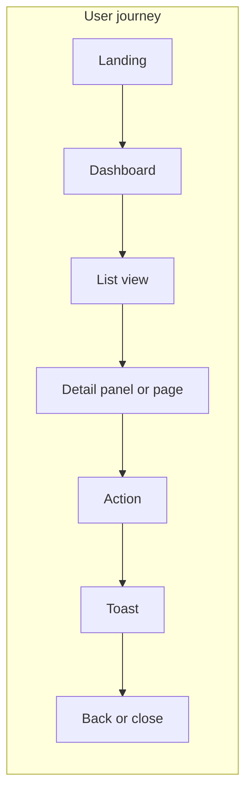

# VPN Suite Admin — Design System

Enterprise-grade admin UI: dark-mode first, 8px grid, minimal cognitive load. Aligned with Linear/Stripe quality bar.

## Color tokens (dark mode first)

### Surfaces
| Token | Usage |
|-------|--------|
| `--surface-base` | Deepest layer (page bg) |
| `--surface-raised` | Cards, panels |
| `--surface-overlay` | Modals, popovers |

### Borders
| Token | Usage |
|-------|--------|
| `--border-subtle` | Dividers, row borders |
| `--color-border-default` | Inputs, cards |
| `--color-border-strong` | Focus, emphasis |

### Text
| Token | Usage |
|-------|--------|
| `--text-primary` / `--color-text-primary` | Headings, labels |
| `--text-secondary` / `--color-text-secondary` | Body, descriptions |
| `--text-tertiary` / `--color-text-tertiary` | Hints, captions |

### Accent
| Token | Usage |
|-------|--------|
| `--accent-primary` | CTAs, links |
| `--accent-hover` | Hover state |
| `--accent-muted` | Accent backgrounds (badges) |

### Semantic
| Token | Usage |
|-------|--------|
| `--color-success` | Success states |
| `--color-warning` | Warnings |
| `--color-error` | Errors |
| `--color-info` | Info |

## Spacing (8px base)

Use `--space-*` or `--spacing-*`: `--space-1` (4px), `--space-2` (8px), `--space-3` (12px), `--space-4` (16px), `--space-6` (24px), `--space-8` (32px), `--space-12` (48px). Use tokens only; no arbitrary values.

## Border radius

| Token | Value | Usage |
|-------|--------|--------|
| `--radius-sm` | 6px | Buttons, inputs |
| `--radius-md` | 8px | Cards |
| `--radius-lg` | 12px | Modals, panels |
| `--radius-full` | 9999px | Avatars, pills |

## Shadows

Dark: `--shadow-sm`, `--shadow-md`, `--shadow-lg`. Focus: `--shadow-focus`. Use for elevation only; avoid heavy shadows.

## Typography

- **Font**: `--font-family` (Inter), `--font-mono` (JetBrains Mono).
- **Scale**: `--text-xs` (12px) through `--text-2xl` (24px); use `--text-*-line` for line-height.
- **Weights**: `--font-normal` (400), `--font-medium` (500), `--font-semibold` (600).

## Layout

- **Sidebar**: 240px (`--width-sidebar`), fixed left. Collapsible on tablet; overlay on mobile.
- **Breakpoints**: Desktop 1280px+; Tablet 768–1279px; Mobile &lt;768px.
- **Shell**: Sidebar | Main (Header + Content + optional Context Panel).

## Component patterns

### Cards
- Structure: `Card` > `CardHeader` (title + optional Actions) > `CardContent`.
- Style: `--surface-raised`, `--border-subtle`, padding `--space-6`, `--radius-md`. Hover: subtle border change.

### Buttons
- **Primary**: accent bg, 36px height, 0 16px padding. One primary per screen.
- **Secondary**: border, transparent bg, hover overlay.
- **Ghost**: no border, hover raised.

### Tables
- Sticky header; row hover `--surface-overlay`; cell padding 12px 16px; row border `--border-subtle`. Optional sortable columns, optional left checkbox column.

### Modals vs panels
- Prefer **drawer/panel** (slide-in from right) for detail views. Use **modal** for confirmations or small forms.

### Empty state
- Icon (48px), title (e.g. "No data yet"), description, primary button. Centered, `--space-6` between elements.

### Loading
- Skeleton: pulse, match layout, `--surface-overlay` shimmer. Spinner: 20px, accent.

### Error
- **Inline**: below input, `--color-error`, text-sm, icon. **Page**: centered "Something went wrong", message, "Try again" button.

## UX rules

- **Max 3 clicks** to primary action.
- **Navigation**: Back (top-left in detail), breadcrumb, ⌘K global search, Escape closes overlays.
- **Actions**: Max 3 visible in header; rest in overflow dropdown. One primary action per screen.

## Do / Don't

**Do**: 8px grid; token-only spacing; one primary CTA; skeleton loaders; panels for details; Escape to close; WCAG AA contrast; &lt;200ms animations.

**Don't**: Heavy gradients/neon; &gt;200ms animations; modal overload; centered data-heavy layouts; inconsistent spacing; missing loading/empty states; &gt;3 header actions.

## Code & accessibility

- Use CSS variables for all design decisions. No hardcoded colors/spacing.
- Focus: `--shadow-focus`; visible focus on interactive elements.
- ARIA: `nav` for sidebar, `dialog` for modal, `region`/`aria-label` for drawer. Skip link present.
- Keyboard: Tab, Escape, ⌘K (Ctrl+K). Motion: `--duration-fast` (150ms) for feedback, `--duration-normal` (250ms) for panels.

## UX flow

- **Max 3 clicks** to primary action: Dashboard → list → row/detail → action.
- Prefer **drawer/panel** for detail when opened from list; **full page** for direct link.
- **Escape** closes overlay/drawer/modal; **⌘K** opens command palette.

## Orbital-grade theme

Mission-critical control interfaces (HUD-style): readability over decoration, status at a glance, 2px left accent for selection, token-driven. Set via `html[data-theme="orbital"]` in tokens.css. Spec: surface `--color-surface` #111111, row hover `--color-overlay` #1A1A1A, selection bar `--color-accent` #1E6FFF, `--radius-sm` 2px. Status table: row height 42px, monospace for IDs/values, Badge for status (online/degraded/offline), MiniSparkline for latency. See design-system primitives and `StatusTable.css`.

## Reference

- Live tokens and components: Admin app → **Settings → Style guide**.
- Token source: `frontend/admin/src/design-system/tokens.css` (admin); miniapp: `frontend/miniapp/src/shared-inline/theme/tokens.css`.
