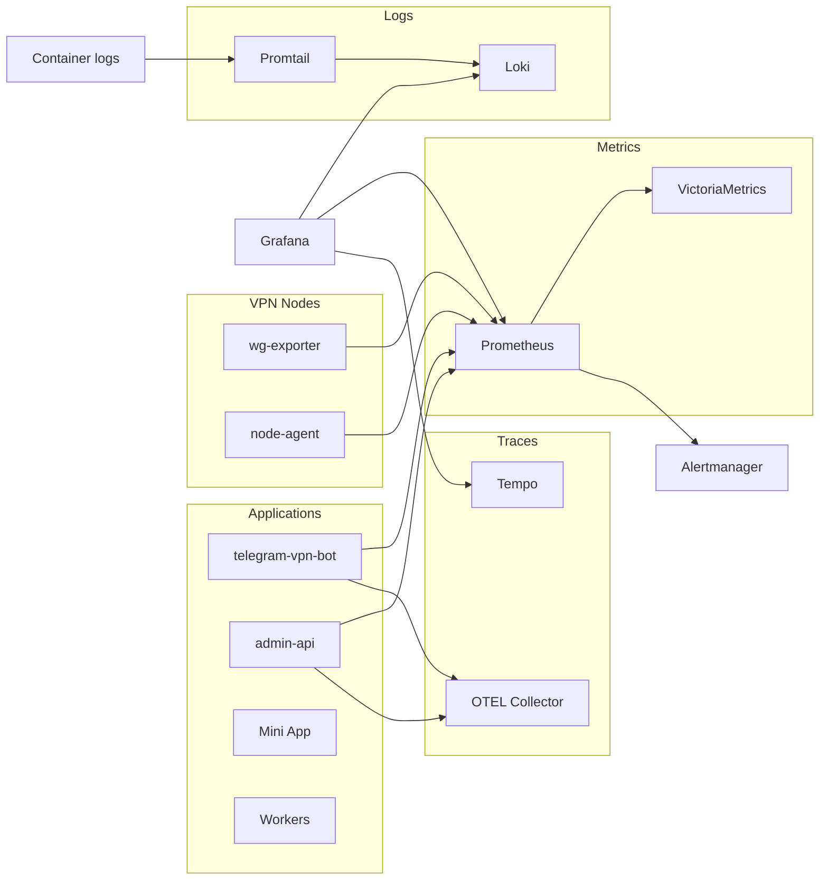

# Observability Architecture

Production-grade metrics, logs, and traces for VPN Suite.

## Diagram

Components:

- **Applications:** admin-api, telegram-vpn-bot, Mini App, Workers → expose /metrics; admin-api and bot → OTLP to OTEL Collector.
- **VPN Nodes:** wg-exporter, node-agent → Prometheus scrape.
- **Metrics:** Prometheus (scrape, alerts) → VictoriaMetrics (remote_write).
- **Logs:** Docker containers → Promtail → Loki.
- **Traces:** OTEL Collector → Tempo.
- **Grafana:** queries Prometheus, Loki, Tempo; Alertmanager receives alerts from Prometheus.

## Central Ingestion

- **Metrics:** Prometheus is the central metrics ingestion (scrape). discovery-runner populates file_sd targets.
- **Logs:** Container logs → Promtail → Loki.
- **Traces:** admin-api and bot export OTLP when OTEL_TRACES_ENDPOINT is set.

## Components

| Component | Role | Ports |
|-----------|------|-------|
| Prometheus | Scrape, evaluate alerts, TSDB | 9090 |
| VictoriaMetrics | Long-term metrics (remote_write) | 8428 |
| Alertmanager | Route alerts | 9093 |
| Loki | Log aggregation | 3100 |
| Promtail | Ship container logs to Loki | 9080 |
| Tempo | Trace storage | 3200, 4317 |
| OTEL Collector | Receive OTLP, forward to Tempo | 4317, 4318 |
| Grafana | Dashboards | 3000 |
| discovery-runner | Populate file_sd targets.json | — |
| wg-exporter | WireGuard metrics per VPN node | 9586 |

See target-architecture.md and current-state.md for full details.
