## Live observability architecture (vpn-suite)

**Goal:** near real-time (≈1–2s) visibility for critical admin dashboards without hammering Prometheus/DB.

### Components

- **Node agents / telemetry loops**
  - `run_telemetry_poll_loop` and node-agents remain the producers of raw node/device metrics.
  - Results land in Redis (`telemetry:server:{id}`, device telemetry keys) and are periodically folded into the snapshot cache by `run_snapshot_aggregator`.

- **Live metrics aggregator (new)**
  - Reads **only Redis-backed caches** (snapshot + telemetry keys), never Prometheus/DB.
  - Normalizes into a compact schema:
    - Per-node: `node_id`, `status`, `heartbeat_age_s`, `peer_count`, `rx_bytes`, `tx_bytes`, `cpu_pct`, `ram_pct`, `stale`, `incident_flags`.
    - Cluster summary: counts of `online/degraded/down`, total peers, traffic, staleness flags.
  - Writes a **hot-state view** into Redis under `live:*` keys with strict TTLs (15–30s) and bounded payload size.

- **SSE fanout endpoint (new)**
  - `GET /api/v1/live/metrics` (FastAPI router).
  - Single SSE stream per browser tab; emits:
    - `snapshot` event with current cluster + node list.
    - `patch` events with only changed nodes and summary deltas.
    - `degraded` events when Redis/aggregator/agents are unhealthy or backpressure kicks in.
  - Reads from `live:*` Redis keys; never queries Prometheus/DB directly.

- **Admin UI (React)**
  - New `liveMetricsClient` manages SSE connection, auth, reconnects, and local throttling (max 1fps renders).
  - `LiveMetricsStore` holds the latest cluster snapshot and applies patches.
  - Telemetry pages (nodes & operator dashboard tiles) consume hooks like `useClusterLiveMetrics()` and `useNodeLiveMetrics(nodeId)` to drive:
    - Live cluster KPIs and health tiles.
    - Node tables and “live cluster health” panels.
  - When live streaming is disabled or degraded, components fall back to existing REST / Prometheus-backed queries.

### Data flow

```mermaid
flowchart LR
  subgraph nodesCluster [VpnNodes]
    nodeAgent1[NodeAgent1]
    nodeAgent2[NodeAgent2]
    nodeAgentN[NodeAgentN]
  end

  nodesCluster -->|"peers, traffic, health"| telemetryPoll[TelemetryPollLoop]
  telemetryPoll -->|"per-server + device telemetry"| redisTelemetry[(Redis telemetry:server, device_telemetry)]

  redisTelemetry --> snapshotAgg[SnapshotAggregator]
  snapshotAgg -->|"nodes/devices/sessions/meta"| snapshotCache[(Redis snapshot_* keys)]

  subgraph livePipeline [Live pipeline]
    liveAgg[LiveMetricsAggregator]
    liveRedis[(Redis live:* hot state)]
    sseEndpoint[SSE /api/v1/live/metrics]
  end

  snapshotCache --> liveAgg
  redisTelemetry --> liveAgg
  liveAgg -->|"normalized state"| liveRedis
  liveRedis --> sseEndpoint

  sseEndpoint -->|"SSE events"| adminUi[ReactAdminDashboard]
```

### Hot vs cold paths

- **Hot path (live dashboards, 1–2s target):**
  - Node/agent → telemetry poll → Redis telemetry/snapshot → live aggregator → Redis `live:*` → SSE → UI.
  - No Prometheus/DB calls on the live fanout path.
- **Cold path (history, analytics, heavy charts):**
  - Prometheus, Loki, Tempo, and existing analytics endpoints remain the source of truth for:
    - KPIs over minutes/hours (`/analytics/metrics/kpis`).
    - Historical charts and deep-dive dashboards.
  - UI continues to call existing analytics/overview endpoints for these views.

### Backpressure and degradation (architecture level)

- Aggregator and SSE layer expose internal Prometheus metrics (e.g. `live_connections`, `live_events_out_total`,
  `live_fanout_latency_seconds`, `live_dropped_updates_total`, `live_queue_depth`).
- When thresholds are exceeded:
  - Tier 2 metrics (CPU/RAM/disk, non-critical charts) slow down or pause.
  - Tier 1 metrics (peer counts, bandwidth deltas) degrade from 2–5s → 10–15s.
  - Tier 0 (node up/down, heartbeat age, incidents) remains at ≈1–2s as long as possible.
- Circuit breaker:
  - If Redis or agent/telemetry sources are unhealthy, the live pipeline stops emitting and closes SSE streams gracefully.
  - UI shows a degraded banner and falls back to slower REST polling.

### Auth, tenancy, and safety

- SSE endpoint uses the same auth/RBAC model as existing admin APIs.
- Multi-tenant safety:
  - Aggregator filters nodes/services by tenant/org context where applicable.
  - Payloads are shaped to avoid cross-tenant leakage by design.
- Reconnect storms:
  - Rate-limiting on `GET /api/v1/live/metrics` plus client-side jittered backoff.
  - Fanout caps per process and per-user to prevent admin-api overload.

