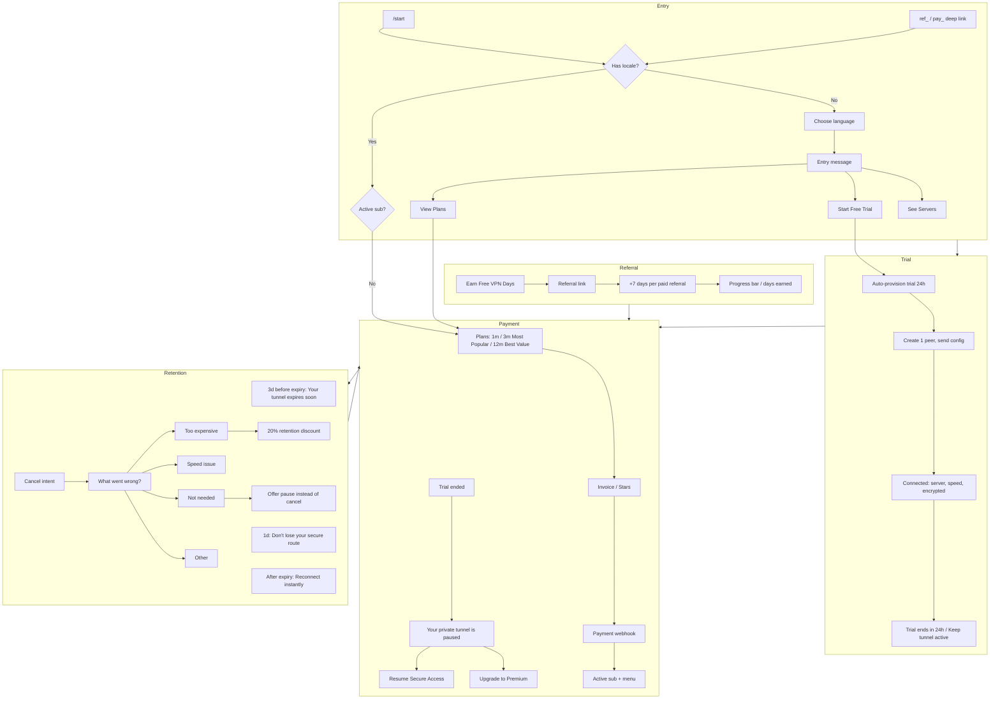

# Revenue Engine Funnel

See plan: High-Conversion VPN Revenue Engine — Implementation Plan.

## Funnel flow (mermaid)

## Key copy

- Entry: "You are 1 tap away from secure private internet."
- Trial connected: "You are connected to {server}. Speed: X Mbps. Your traffic is encrypted." + "Trial ends in 24h."
- Tunnel paused: "Your private tunnel is paused." [Resume Secure Access] [Upgrade to Premium]
- Plans: 1 month | 3 months (Most Popular) | 12 months (Best Value); "Average user stays 7 months."
- Referral: "Earn Free VPN Days", "+7 days per paid referral", "You earned X secure days this month."
