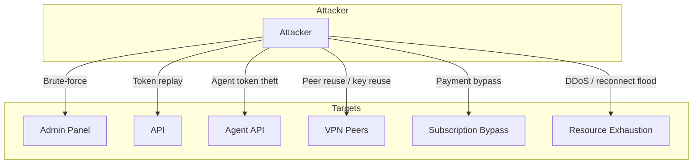

# Threat Model

---

## 1. Attack Tree Overview

---

## 2. Threat Scenarios & Mitigations

### 2.1 Brute-force Login

| Attack | Description | Mitigation |
|--------|-------------|------------|
| SSH | Password guessing on port 22 | fail2ban; key-only auth; disable root login |
| Admin panel | JWT / password guessing | Login rate limit (10/window); Redis-based; security logger |
| Bot webhook | Fake Telegram requests | Validate initData / webhook secret |

**Simulation**: Send 15+ failed login attempts from same IP → expect 429 (rate limited).

---

### 2.2 Token Replay

| Attack | Description | Mitigation |
|--------|-------------|------------|
| JWT reuse | Stolen access token | Short expiry (15 min); refresh token rotation |
| Refresh token | Reuse after revocation | Check DB/Redis on refresh; blacklist on logout |
| WebApp session | Bearer token theft | 1h expiry; HTTPS only |
| Config download token | One-time token reuse | Mark used; expiry; audit |

**Simulation**: Replay expired JWT → 401. Replay used config token → 404/403.

---

### 2.3 Subscription Bypass

| Attack | Description | Mitigation |
|--------|-------------|------------|
| Issue without payment | Call issue API without subscription | Backend validates subscription status, valid_until |
| Modify subscription in DB | Direct DB access | Postgres internal network; role separation |
| Reuse device config | Share config across users | Device tied to user; revocation invalidates |
| Pay and cancel, keep config | Use config after cancel | Device expiry task; limits_check auto-block |

**Simulation**: Issue device for user with expired sub → expect 403/validation error.

---

### 2.4 Peer Reuse / Key Reuse

| Attack | Description | Mitigation |
|--------|-------------|------------|
| Same public key on multiple devices | One config, many clients | DB uniqueness; AllowedIPs per peer |
| Reuse revoked peer key | Re-add old key | Revocation removes from WG config; reconciliation |
| Key in logs | Private key exposure | Redaction; no logging of secrets |

**Simulation**: Add peer with duplicate public_key → DB constraint or overwrite logic per design.

---

### 2.5 Resource Exhaustion

| Attack | Description | Mitigation |
|--------|-------------|------------|
| API flood | High request rate | Global API rate limit (200/min per IP); Redis |
| Login flood | Many login attempts | Login failure rate limit; fail-closed option |
| Reconnect flood | Many WG handshakes | Kernel limits; AmneziaWG ulimits (nofile 51200) |
| DB connection exhaustion | Too many connections | Connection pool; limits |
| Redis exhaustion | Cache/rate-limit abuse | Redis maxmemory; eviction policy |
| Disk | Log/backup fill | Log rotation; backup retention |

**Simulation**: Send 250 req/min from one IP → 429 after limit. Redis down → rate limit fail-open (configurable).

---

### 2.6 Agent API Abuse

| Attack | Description | Mitigation |
|--------|-------------|------------|
| Forge agent requests | No mTLS | mTLS required at Caddy; client cert verification |
| Steal X-Agent-Token | Token leak | Timing-safe comparison; rotate via rotate-agent-token.sh |
| Unauthorized CIDR | Attacker IP in allowlist | AGENT_ALLOW_CIDRS restrict to known node IPs |
| Docker socket via agent | Agent has docker.sock | Agent runs with minimal caps; restrict to control-plane node |

---

### 2.7 DDoS Basic Resilience

| Vector | Mitigation |
|--------|------------|
| HTTP flood | Caddy; rate limit at app layer |
| SYN flood | Kernel tcp_max_syn_backlog; conntrack |
| UDP (WG) | Legitimate traffic mixed; no app-layer rate limit on WG |
| Bandwidth | Upstream provider; consider WAF/CDN for admin |

---

## 3. Trust Boundaries Summary

| Boundary | Trust Level | Controls |
|----------|-------------|----------|
| Internet → Caddy | Untrusted | TLS; HSTS; UFW |
| Caddy → admin-api | Internal | Docker network |
| Caddy → Agent API | Authenticated | mTLS + X-Agent-Token |
| admin-api → Postgres/Redis | Internal | Internal network; credentials |
| Node agent → Control plane | Authenticated | mTLS + token |
| Admin panel users | Authenticated | JWT; RBAC |
| Bot/WebApp users | Authenticated | X-API-Key; Bearer; Telegram initData |

---

## 4. Residual Risks

- **Fail2ban**: SSH brute-force risk until `./ops/setup-fail2ban.sh` is run in production.
- **Backup encryption**: pg_dump and Redis dumps stored unencrypted — consider GPG or cloud KMS.
