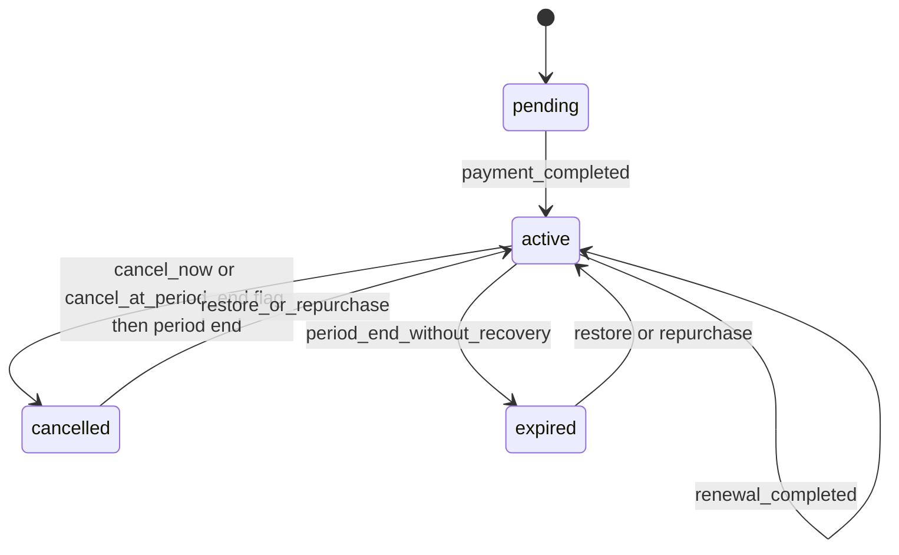
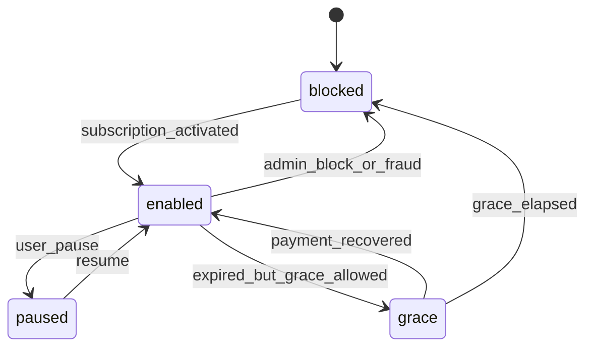

# Billing State Machine

**Status:** Proposed  
**Audience:** Backend, Billing, Product, QA, Admin  
**Scope:** Subscription lifecycle, access lifecycle, payment effects, grace, restore, idempotency

---

## 1. Purpose

This document defines the canonical billing and entitlement state model for VPN Suite.

The main rule is simple: stop stuffing commercial lifecycle, billing resolution, and access control into one heroic enum. That way lies support chaos and spreadsheet archaeology.

---

## 2. Canonical State Dimensions

`Subscription` must expose four independent state dimensions.

| Field | Allowed values | Meaning |
|---|---|---|
| `subscription_status` | `pending`, `active`, `cancelled`, `expired` | commercial lifecycle |
| `access_status` | `enabled`, `grace`, `paused`, `blocked` | actual current access |
| `billing_status` | `unpaid`, `paid`, `refunded`, `chargeback_like` | financial resolution |
| `renewal_status` | `auto_renew_on`, `auto_renew_off` | renewal intent |

---

## 3. Subscription Rules

### 3.1 Valid combinations

Examples of valid real-world combinations:

| subscription_status | access_status | billing_status | Example |
|---|---|---|---|
| `pending` | `blocked` | `unpaid` | invoice exists, not yet paid |
| `active` | `enabled` | `paid` | normal paid user |
| `expired` | `grace` | `unpaid` | failed renewal with recovery window |
| `active` | `paused` | `paid` | paid but voluntarily paused |
| `cancelled` | `enabled` | `paid` | cancel at period end while still valid |
| `cancelled` | `blocked` | `paid` | cancelled and period ended |
| `expired` | `blocked` | `unpaid` | fully lapsed |
| `active` | `blocked` | `chargeback_like` | fraud or risk action |

### 3.2 Invalid combinations

These should fail validation or be auto-corrected:
- `pending + enabled`
- `expired + paid` when `valid_until` is in the past and no fresh extension exists
- `grace` without `grace_until`
- `paused` with missing `paused_at`

---

## 4. State Transitions

## 4.1 Commercial lifecycle



### Transition rules

| Trigger | Old state | New state | Notes |
|---|---|---|---|
| payment completed | pending | active | create entitlement |
| renewal completed | active | active | extend `valid_until` |
| cancel now | active | cancelled | access may block immediately based on policy |
| cancel at period end | active | cancelled | keep access until `valid_until` |
| period end | active/cancelled | expired or cancelled+blocked | depends on policy and dates |
| restore | expired/cancelled | active | apply payment or valid recovery rule |

## 4.2 Access lifecycle



---

## 5. Grace Period

### 5.1 Requirements
- `grace_until` is mandatory whenever `access_status = grace`.
- Grace duration must be configurable.
- Existing devices may continue to function during grace.
- New device issuance should be blocked by default during grace.
- Restore path must preserve prior setup.

### 5.2 Recommended defaults
- initial default: `48h`
- configurable by plan or campaign
- show recovery CTA prominently in UI

### 5.3 Grace entry triggers
- renewal invoice expired,
- payment failed,
- admin-approved temporary recovery window.

### 5.4 Grace exit triggers
- successful payment and entitlement restore,
- explicit admin block,
- `now > grace_until`.

---

## 6. Cancellation Modes

### Supported modes
- `cancel_now`
- `cancel_at_period_end`
- `pause_instead`

### Behavior matrix

| Action | subscription_status | access_status | Notes |
|---|---|---|---|
| cancel now | `cancelled` | `blocked` or `grace` | policy-driven |
| cancel at period end | `cancelled` | `enabled` | until `valid_until` |
| pause instead | `active` | `paused` | preserve devices |

### Reason-driven retention
Before final cancellation, the system should branch:
- too expensive -> discount or downgrade,
- not using -> pause,
- speed issues -> diagnostics or server switch,
- more devices needed -> upgrade,
- temporary break -> pause.

---

## 7. Payment Effects

## 7.1 Payment statuses
`Payment.status` should support:
- `pending`
- `invoice_opened`
- `completed`
- `failed`
- `expired`
- `refunded`

## 7.2 Required payment events
- `payment_created`
- `invoice_opened`
- `payment_completed`
- `payment_failed`
- `payment_expired`
- `payment_refunded`
- `webhook_received`
- `webhook_processed`
- `webhook_failed`

## 7.3 Required entitlement events
- `subscription_activated`
- `subscription_renewed`
- `subscription_extended`
- `grace_started`
- `grace_converted`
- `access_paused`
- `access_resumed`
- `access_blocked`
- `referral_reward_accrued`
- `referral_reward_applied`
- `promo_applied`

---

## 8. Idempotency Rules

These operations must be idempotent:

| Operation | Idempotency key |
|---|---|
| payment completion | `provider + external_id + payment_id` |
| entitlement extension | `subscription_id + entitlement_event_source` |
| referral apply | `referral_id + reward_cycle` |
| promo redemption | `payment_id + promo_id` |
| restore flow | `subscription_id + restore_attempt_id` |

Retries must not produce duplicate access extensions. Duplicate access extension is how finance and support both begin making that special face.

---

## 9. Pseudocode

```ts
function handlePaymentCompleted(payment: Payment) {
  if (alreadyProcessed(payment.provider, payment.external_id, payment.id)) return;

  markPaymentCompleted(payment.id);
  appendPaymentEvent(payment.id, 'payment_completed');

  const sub = loadSubscription(payment.subscription_id);

  if (sub.subscription_status === 'pending') {
    activateSubscription(sub.id);
    appendEntitlementEvent(sub.id, 'subscription_activated');
    return;
  }

  if (sub.subscription_status === 'active' || sub.subscription_status === 'expired' || sub.subscription_status === 'cancelled') {
    extendOrRestoreSubscription(sub.id);
    appendEntitlementEvent(sub.id, 'subscription_extended');
  }
}
```

---

## 10. Acceptance Criteria

This document is implemented when:
- split state fields exist in the data model,
- validation rejects invalid combinations,
- grace is explicit and time-bounded,
- cancellation supports immediate, period-end, and pause modes,
- payment and entitlement actions are ledgered immutably,
- duplicate provider callbacks do not duplicate entitlement changes.
