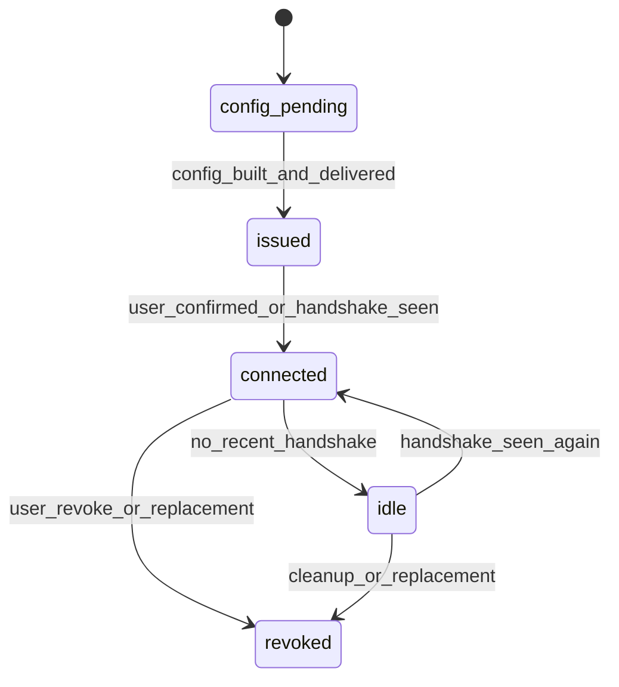

# Device Lifecycle

**Status:** Proposed  
**Audience:** Backend, Frontend, Product, QA, Support, Admin  
**Scope:** Device issuance, slot usage, connection confirmation, revoke, replacement, server switching

---

## 1. Purpose

This document defines the canonical lifecycle of a VPN device record and the slot model behind it.

A device is not just a row with a public key. It is the main unit of perceived product success. The user judges the whole business by whether their phone connects in under five minutes.

---

## 2. Data Model

```ts
Device {
  id
  user_id
  subscription_id
  server_id
  name
  platform
  public_key
  apply_status
  slot_status
  issued_at
  revoked_at
  last_handshake_at
  last_server_id
  last_config_delivered_at
  last_connect_confirmed_at
}
```

### Required supporting fields
- `apply_status`: config delivery / provisioning state
- `slot_status`: active slot accounting state
- `last_handshake_at`: most recent control-plane signal
- `last_connect_confirmed_at`: explicit confirmed working state

---

## 3. Device States

## 3.1 Recommended display states
- `config_pending`
- `issued`
- `connected`
- `idle`
- `revoked`

These may be derived from lower-level fields if you prefer not to persist them directly.

## 3.2 Lifecycle diagram



---

## 4. Slot Model

### 4.1 Rules
- Only non-revoked devices count against `device_limit`.
- Revoked devices remain stored for audit/history.
- Users must be able to reclaim a slot without support.
- Over-limit attempts must branch to replace-or-upgrade, not to a sad dead end.

### 4.2 Countable states

| State | Counts toward limit |
|---|---|
| `config_pending` | yes |
| `issued` | yes |
| `connected` | yes |
| `idle` | yes |
| `revoked` | no |

This is intentionally strict. Otherwise users create config confetti and support gets to sweep it up.

---

## 5. Issuance Flow

```text
Open Devices
  -> Issue device
  -> choose platform
  -> choose auto or manual server
  -> create device record
  -> build config variants
  -> deliver QR / file / text
  -> wait for connect confirmation
```

### Issuance requirements
- auto-select server by default,
- manual server selection available as advanced mode,
- config variants may include QR, downloadable file, and raw text,
- issuance retries must be idempotent by attempt token.

---

## 6. Connection Confirmation

### Confirmation methods
- manual user confirm,
- handshake detected,
- optional public IP verification.

### Required effects
When device is considered connected:
- set `last_connect_confirmed_at`,
- update device display state to `connected`,
- if this is the first working device for the user, set `first_connected_at` on `User`.

---

## 7. Idle Detection

A device becomes `idle` when no handshake has been observed within a configurable threshold.

### Recommended defaults
- `idle_after_minutes = 60` for live UX badges,
- separate slower thresholds for archival heuristics.

### Required behavior
- idle devices still count toward slot limit,
- idle devices should be candidates for slot replacement,
- UI should explain that idle does not necessarily mean broken.

---

## 8. Slot Replacement

### Primary use case
User has reached device limit and wants a new device.

### Flow
```text
Attempt issue beyond limit
  -> show current devices
  -> highlight oldest or idle candidates
  -> user chooses replacement target
  -> revoke old device
  -> create new device
  -> deliver config
```

### Requirements
- replacement must be self-serve,
- revoked device remains visible in history,
- replacement action must be auditable,
- frontend should offer “replace oldest idle device” shortcut.

### API suggestion
`POST /webapp/devices/:id/replace-with-new`

---

## 9. Server Switching

### Requirements
- server switch should be possible from device detail,
- smart recommendation should remain the default,
- server tags should explain *why* something is suggested:
  - `Fastest`
  - `Lowest load`
  - `Closest region`
  - `Best for streaming`

### Effects
Server switch should:
- update `last_server_id`,
- update `server_id` after activation,
- trigger config rebuild,
- emit telemetry event `server_switched`.

---

## 10. Revoke Rules

### Supported revoke reasons
- user removed device,
- lost device,
- security rotation,
- slot replacement,
- admin action.

### Required effects
- set `revoked_at`,
- mark slot as reusable,
- preserve history,
- revoke server-side peer where applicable,
- emit telemetry and audit event.

---

## 11. UI Surface Requirements

Devices page must show:
- device name,
- platform,
- current server,
- last handshake,
- display state,
- primary action per row: `Reconnect`, `Reissue`, `Switch server`, `Revoke`.

The Devices page is not CRUD with a haircut. It is the connectivity control center.

---

## 12. Acceptance Criteria

This spec is implemented when:
- device states are explicit or cleanly derived,
- slot counting rules are deterministic,
- users can replace a device without support,
- connection confirmation updates both device and user milestones,
- revoked devices stop counting but remain auditable,
- server switching is contextual and rebuilds config safely.
