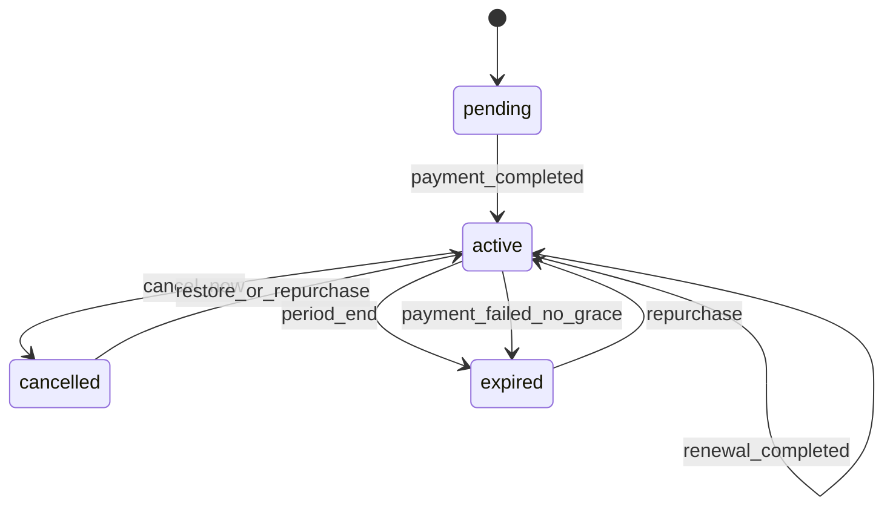
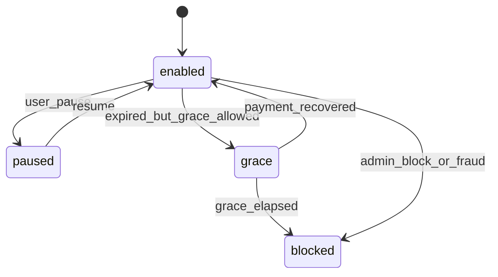
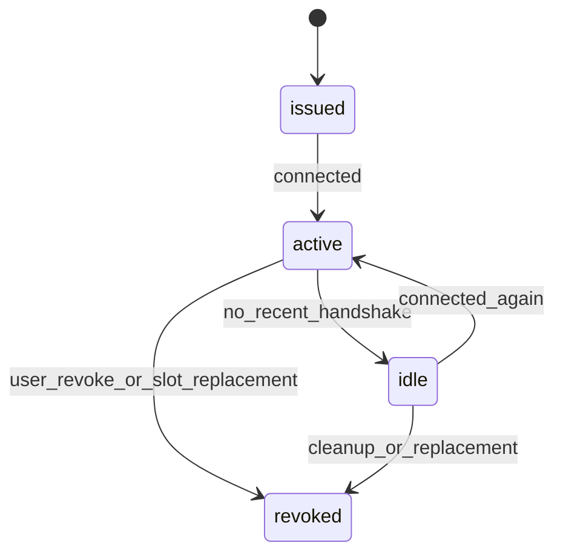

# VPN Suite Business Logic & Userflows Spec v2

**Status:** Proposed  
**Audience:** Product, Backend, Frontend, Admin Panel, Analytics, QA  
**Scope:** Consumer Mini App, Telegram Bot entrypoints, subscription lifecycle, device lifecycle, payments, referrals, retention, telemetry

---

## 1. Purpose

This document defines the target business logic and userflow architecture for the VPN Suite consumer experience.

It upgrades the current model by:
- separating commercial state from access state,
- reducing user friction in onboarding and first connection,
- making cancellation, grace, referrals, and device management more revenue-safe,
- standardizing telemetry for funnel analysis,
- turning the current feature set into a cleaner operator-grade product model.

This spec is intended to be repo-ready and implementation-oriented. It should be treated as the source of truth for product behavior until replaced by a later version.

---

## 2. Product Principles

1. **Connection first.** Users do not care about internal architecture. The system should optimize for getting the user connected with minimal clicks.
2. **State must be explicit.** Billing state, subscription state, and access state must not be mixed into one muddy enum.
3. **Retention beats rigidity.** Grace periods, pause flows, save offers, and fast restore should be first-class behavior.
4. **Devices are an experience surface.** Device management is not CRUD; it is the connectivity control center.
5. **Every critical step must be measurable.** If onboarding, invoice, connection, or cancellation is not instrumented, it is basically folklore.
6. **Idempotency everywhere.** Payments, rewards, device issuance, and retries must be safe under duplicate events.

---

## 3. Target Architecture Overview

### 3.1 Surfaces

- **Telegram Bot** — thin entry, referral attribution, payment confirmation, launchpad into Mini App
- **Mini App** — primary consumer interface
- **Admin Panel** — operator control plane
- **Backend / Control Plane** — auth, billing, entitlement, device issuance, server selection, telemetry, retention

### 3.2 Core flow philosophy

The first-run experience should not route the user through generic pages. It should route the user to the next missing outcome:

- no subscription -> choose a plan
- subscription exists but no device -> issue first device
- device exists but not confirmed connected -> finish connection
- fully active user -> home/dashboard

That means routing must be **state-driven**, not just page-driven.

---

## 4. Business Domain Model

### 4.1 Core entities

| Entity | Purpose | Notes |
|---|---|---|
| `User` | Consumer identity tied to Telegram | Stores acquisition and routing metadata |
| `Plan` | Commercial offer | Duration, price, tier, limits, upsell metadata |
| `Subscription` | Commercial subscription record | Tracks lifecycle and entitlements |
| `Device` | Issued VPN client / peer identity | Tracks slot usage and connection state |
| `Server` | Target VPN node / region | Tracks recommendation and capacity signals |
| `Payment` | One invoice / payment attempt | Provider-facing and internal billing record |
| `PaymentEvent` | Immutable payment event log | Audit trail for payment lifecycle |
| `EntitlementEvent` | Immutable access/reward change log | Audit trail for subscription effects |
| `Referral` | Referrer/referee attribution and reward state | Reward accrual must be independent of immediate application |
| `PromoCode` | Promotion definition | Value, constraints, scope |
| `PromoRedemption` | Applied promo usage | Immutable per payment / subscription event |
| `ChurnSurvey` | Cancellation reason capture | Drives offer logic and analytics |

### 4.2 State separation

The current model mixes too much into one subscription status. That is a bug farm in a nice suit.

#### Required split

`Subscription` must have these state groups:

| Field | Allowed values | Meaning |
|---|---|---|
| `subscription_status` | `pending`, `active`, `cancelled`, `expired` | Commercial lifecycle state |
| `access_status` | `enabled`, `grace`, `paused`, `blocked` | Current access state |
| `billing_status` | `unpaid`, `paid`, `refunded`, `chargeback_like` | Billing resolution state |
| `renewal_status` | `auto_renew_on`, `auto_renew_off` | Renewal intent |

This enables normal real-world states such as:
- subscription expired but access still in grace,
- subscription active but access paused,
- subscription cancelled at period end while access remains enabled,
- payment pending while subscription is not yet active.

### 4.3 Recommended entity fields

#### User

```ts
User {
  id
  tg_id
  meta
  onboarding_step
  onboarding_completed_at
  onboarding_version
  preferred_server_id
  server_auto_select
  acquisition_source
  referral_campaign
  last_active_at
  first_connected_at
  last_connection_confirmed_at
}
```

#### Plan

```ts
Plan {
  id
  code
  name
  tier
  duration_days
  price_amount
  price_currency
  device_limit
  is_trial
  upsell_methods
  is_active
}
```

#### Subscription

```ts
Subscription {
  id
  user_id
  plan_id
  valid_from
  valid_until
  subscription_status
  access_status
  billing_status
  renewal_status
  cancel_at_period_end
  paused_at
  paused_reason
  grace_until
  grace_reason
  is_trial
  trial_ends_at
  accrued_bonus_days
  created_at
  updated_at
}
```

#### Device

```ts
Device {
  id
  user_id
  subscription_id
  server_id
  name
  platform
  public_key
  apply_status
  slot_status
  issued_at
  revoked_at
  last_handshake_at
  last_server_id
  last_config_delivered_at
  last_connect_confirmed_at
}
```

#### Server

```ts
Server {
  id
  name
  region
  api_endpoint
  vpn_endpoint
  status
  is_active
  max_connections
  health_score
  latency_score
  capacity_used_percent
  recommended_for
}
```

#### Payment

```ts
Payment {
  id
  user_id
  subscription_id
  provider
  status
  amount
  currency
  external_id
  invoice_opened_at
  completed_at
  failed_at
  promo_code_snapshot
  webhook_payload
  created_at
}
```

#### Referral

```ts
Referral {
  id
  referrer_user_id
  referee_user_id
  referral_code
  status
  reward_days
  pending_reward_days
  reward_applied_at
  source_channel
  created_at
}
```

#### ChurnSurvey

```ts
ChurnSurvey {
  id
  user_id
  subscription_id
  reason_group
  reason_code
  free_text
  discount_offered
  offer_accepted
  created_at
}
```

---

## 5. Canonical State Machines

### 5.1 Subscription lifecycle



### 5.2 Access lifecycle



### 5.3 Device slot lifecycle



---

## 6. Business Rules

### 6.1 Grace period

Grace is a first-class business rule, not a support accident.

#### Requirements
- On expiration or failed renewal, the system may move the subscription to:
  - `subscription_status = expired`
  - `access_status = grace`
- `grace_until` must be stored explicitly.
- Default grace window should be configurable, e.g. `24h`, `48h`, or `72h`.
- During grace:
  - existing devices may continue to work,
  - new device issuance may be blocked,
  - plan changes may still be allowed,
  - the UI must show “restore access” and not behave like the user fell into a billing sinkhole.

#### Goals
- reduce involuntary churn,
- preserve user setup,
- improve recovery conversion after failed or missed payment.

### 6.2 Referral rewards

Referral reward accrual must not depend on the referrer already having an active subscription.

#### Required behavior
- When referee becomes eligible, reward must always accrue.
- If referrer has active subscription, apply reward immediately.
- If referrer has no active subscription, store reward as `pending_reward_days`.
- Pending reward must apply automatically on the referrer’s next activation or purchase.

This avoids the classic “thanks for growth, here is nothing” anti-pattern.

### 6.3 Device slots

`device_limit` is not enough. Slot behavior must be explicit.

#### Required rules
- Count only non-revoked devices toward active slot usage.
- Allow user to revoke and reuse a slot without support.
- Support “replace oldest inactive device” flow.
- Support temporary upsell flow for over-limit state.
- Store archived devices for audit even after revoke.

#### Over-limit behavior
When user attempts issuance beyond allowed slots:
- show existing devices,
- highlight inactive or oldest candidates for replacement,
- offer upgrade path if higher tier supports more devices.

### 6.4 Cancellation behavior

Cancellation should not be a dead-end button.

#### Required branches by reason
| Reason group | Primary response |
|---|---|
| too_expensive | discount, cheaper plan, pause |
| not_using | pause, downgrade, reminder of saved setup |
| slow_or_unstable | switch server, diagnostics, support |
| need_more_devices | upgrade plan |
| privacy_or_trust_concern | explain policy, support escalation |
| temporary_break | pause |

Cancellation should support:
- `cancel_now`
- `cancel_at_period_end`
- `pause_instead`

### 6.5 Win-back behavior

Expired or cancelled users should not be treated like strangers.

#### Required behavior
- preserve device metadata and last server choice,
- keep referral page visible,
- keep account visible with locked-but-restorable state,
- surface “restore connection in 1 tap” CTA,
- apply pending referral reward or promo where valid.

---

## 7. Consumer Routing Specification

### 7.1 Bootstrap flow

```text
Telegram Mini App open
  -> POST /webapp/auth
  -> GET /webapp/me
  -> derive route target from state
  -> redirect to next missing outcome
```

### 7.2 Route resolution algorithm

Pseudo-logic:

```ts
if (!hasSubscription) return '/plan'
if (hasSubscription && !hasIssuedDevice) return '/devices/issue'
if (hasIssuedDevice && !hasConfirmedConnection) return '/connect-status'
return '/'
```

### 7.3 First-run routing requirements

| User state | Route |
|---|---|
| no subscription | `/plan` |
| active trial or paid sub, no device | `/devices/issue` |
| device issued, connection not confirmed | `/connect-status` |
| connected user | `/` |
| expired with grace | `/restore-access` |
| cancelled but still active until period end | `/account/subscription` |

---

## 8. Userflow Specification

### 8.1 Telegram Bot

The bot remains a thin entry layer.

#### Required bot responsibilities
- handle `/start`
- handle `/start ref_XXX`
- attach referral attribution to Mini App URL
- expose **Open App** button
- receive payment confirmation events from Telegram
- call backend payment-confirm endpoint

#### Bot UX
| Trigger | Action |
|---|---|
| `/start` | welcome + Open App |
| `/start ref_xxx` | welcome + referral attributed + Open App |
| payment success | payment confirmed + success reply |

### 8.2 Mini App onboarding

The current 5-step procedural onboarding is too literal and too fragile.

#### Replace with 3 outcome-based steps
1. **Choose device**
2. **Get config**
3. **Confirm connected**

#### Step details

##### Step 1 — Choose device
- user selects platform or device type,
- system preps correct instruction surface,
- if no subscription exists, route to plan first.

##### Step 2 — Get config
- show native install guidance for selected platform,
- support QR, download file, and copy config where applicable,
- show recommended server and advanced manual override,
- if app is already installed, reduce ceremony.

##### Step 3 — Confirm connected
- ask user to confirm connection,
- optionally validate by public IP check / handshake signal where available,
- on success set `first_connected_at` and `last_connection_confirmed_at`.

### 8.3 Purchase flow

#### Required flow
```text
Plan selection
  -> checkout confirmation screen
  -> create invoice
  -> open Telegram invoice
  -> payment success
  -> activate entitlement
  -> issue first device immediately
  -> show connection setup
```

#### Checkout confirmation screen must show
- selected plan,
- billing amount in Stars,
- plan duration,
- device limit,
- renewal behavior,
- promo effect,
- what happens immediately after payment.

Users should never wonder what they just bought. That mystery belongs in horror novels, not billing UX.

### 8.4 Trial flow

#### Required behavior
- one trial per user,
- trial starts only if trial plan and node capacity are available,
- on trial activation immediately issue first device or route directly into device issuance,
- trial must enter the same connection flow as paid users.

#### Conversion nudges
- D0: trial activated,
- D1: reminder of value,
- 24h before expiry: warning,
- at expiry: restore CTA,
- after expiry: preserve setup for frictionless conversion.

### 8.5 Devices flow

The Devices page must act as a **connectivity center**.

#### Devices page must show
- device name,
- platform,
- current server,
- last handshake,
- status: `connected`, `idle`, `revoked`, `config_pending`,
- primary CTA per row: `Reconnect`, `Reissue`, `Switch server`, `Revoke`.

#### Device issuance flow
```text
Open Devices
  -> Issue device
  -> system auto-selects best server
  -> build config variants
  -> deliver QR / file / text
  -> user confirms connected
```

### 8.6 Server selection flow

Server selection should be contextual by default.

#### Required behavior
- default to smart auto-select,
- expose manual selection as advanced mode,
- show recommendation tags such as:
  - `Fastest`
  - `Lowest load`
  - `Closest region`
  - `Best for streaming`
- allow server switch from device detail, not only from a detached page.

### 8.7 Cancellation and pause flow

#### Required flow
```text
User taps cancel
  -> collect reason
  -> show targeted retention offer
  -> allow pause / downgrade / switch / support / cancel
```

#### Pause behavior
- `POST /webapp/subscription/pause`
- set `access_status = paused`
- retain devices and settings
- make restore trivial

### 8.8 Restore access flow

For expired or grace users:
- show summary of previous setup,
- show outstanding plan / amount,
- show one-tap restore CTA,
- preserve server and device context where possible.

---

## 9. API Contract Changes

### 9.1 New or changed endpoints

| Area | Endpoint | Purpose |
|---|---|---|
| session routing | `GET /webapp/session-route` or computed in `/webapp/me` | Return recommended next route |
| grace | `GET /webapp/subscription/access-state` | Return access/grace summary |
| restore | `POST /webapp/subscription/restore` | Recover entitlement after expiry/cancel |
| device slots | `POST /webapp/devices/:id/replace-with-new` | Replace old slot with new issue |
| connect confirmation | `POST /webapp/devices/:id/confirm-connected` | Explicit connection confirmation |
| retention | `GET /webapp/subscription/offers` | Return reason-driven offers |
| cancellation | `POST /webapp/subscription/cancel` | Support reason, offer, at-period-end |
| pause | `POST /webapp/subscription/pause` | Pause access |
| resume | `POST /webapp/subscription/resume` | Resume access |
| referrals | `GET /webapp/referral/status` | Return active + pending rewards |

### 9.2 Recommended `GET /webapp/me` payload additions

```json
{
  "user": {
    "id": "...",
    "onboarding_step": "confirm_connected",
    "first_connected_at": "...",
    "last_connection_confirmed_at": "..."
  },
  "subscription": {
    "subscription_status": "active",
    "access_status": "enabled",
    "billing_status": "paid",
    "renewal_status": "auto_renew_on",
    "grace_until": null,
    "cancel_at_period_end": false,
    "accrued_bonus_days": 7
  },
  "devices": [
    {
      "id": "...",
      "name": "iPhone 15",
      "platform": "ios",
      "status": "connected",
      "last_handshake_at": "...",
      "server_id": "..."
    }
  ],
  "routing": {
    "recommended_route": "/",
    "reason": "connected_user"
  }
}
```

---

## 10. Payments and Entitlement Rules

### 10.1 Payment lifecycle

`Payment.status` should support at least:
- `pending`
- `invoice_opened`
- `completed`
- `failed`
- `expired`
- `refunded`

### 10.2 Payment event ledger

Each payment must emit immutable `PaymentEvent` rows.

#### Required event types
- `payment_created`
- `invoice_opened`
- `payment_completed`
- `payment_failed`
- `payment_expired`
- `payment_refunded`
- `webhook_received`
- `webhook_processed`
- `webhook_failed`

### 10.3 Entitlement event ledger

Each business effect on access or subscription must emit immutable `EntitlementEvent` rows.

#### Required event types
- `subscription_activated`
- `subscription_renewed`
- `subscription_extended`
- `grace_started`
- `grace_converted`
- `access_paused`
- `access_resumed`
- `access_blocked`
- `referral_reward_accrued`
- `referral_reward_applied`
- `promo_applied`

These event ledgers are required for:
- support debugging,
- finance reconciliation,
- auditability,
- analytics without acrobatics.

### 10.4 Idempotency requirements

The following operations must be idempotent by key:
- payment completion by `external_id` and internal `payment_id`,
- referral reward application by referral id + reward cycle,
- promo redemption by payment id + promo id,
- device issuance retries by user + issuance attempt token.

---

## 11. Telemetry Specification v2

### 11.1 Why the current telemetry is insufficient

Top-level funnel events are useful but too coarse. They do not tell where users stall between install intent, invoice intent, config delivery, and actual connection success.

### 11.2 Required event taxonomy

#### App lifecycle
- `dashboard_open`
- `screen_open`
- `cta_click`
- `web_vital`

#### Onboarding
- `onboarding_started`
- `onboarding_step_viewed`
- `onboarding_step_completed`
- `onboarding_abandoned`
- `connect_confirmed`

#### Billing
- `pricing_view`
- `plan_selected`
- `checkout_viewed`
- `invoice_created`
- `invoice_opened`
- `invoice_abandoned`
- `payment_completed`
- `renewal_completed`
- `payment_failed`

#### Trial
- `trial_started`
- `trial_device_issued`
- `trial_expiring_soon`
- `trial_converted`

#### Devices
- `device_issue_started`
- `device_issue_success`
- `device_issue_failed`
- `config_downloaded`
- `qr_opened`
- `device_revoked`
- `server_switched`

#### Retention / churn
- `cancel_flow_started`
- `cancel_reason_selected`
- `retention_offer_shown`
- `retention_offer_accepted`
- `pause_selected`
- `grace_started`
- `grace_converted`
- `winback_clicked`

#### Referral / promos
- `referral_link_viewed`
- `referral_signup_attributed`
- `referral_reward_accrued`
- `referral_reward_applied`
- `promo_validated`
- `promo_applied`

### 11.3 Event payload standards

Every event should include:

```json
{
  "event": "device_issue_success",
  "user_id": "...",
  "session_id": "...",
  "subscription_id": "...",
  "device_id": "...",
  "screen": "/devices/issue",
  "source": "miniapp",
  "ts": "2026-03-07T12:00:00Z",
  "meta": {}
}
```

### 11.4 KPIs

Minimum KPI set:
- plan view -> invoice create conversion,
- invoice create -> invoice open conversion,
- invoice open -> payment completion conversion,
- payment completion -> first device issued conversion,
- device issued -> connected conversion,
- trial start -> paid conversion,
- grace start -> recovered conversion,
- cancel started -> retained conversion,
- referral attributed -> rewarded conversion.

---

## 12. UI / UX Requirements

### 12.1 Home

Home should show:
- connection status hero,
- current subscription state,
- active/grace/paused state badge,
- primary next action,
- device summary,
- server recommendation,
- restore CTA if relevant.

### 12.2 Plan

Plan page should show:
- current plan,
- plan comparison,
- device limit,
- renewal state,
- history,
- upgrade / downgrade / restore actions.

### 12.3 Checkout

Checkout must include a calm pre-invoice confirmation layer. No surprise billing jumps.

### 12.4 Devices

Devices page is a control center, not a sad list.

### 12.5 Support

Support page should prioritize:
- self-diagnostics,
- switch server,
- reconnect instructions,
- FAQ,
- escalation link.

---

## 13. Admin Panel Implications

Admin should expose the new state model directly.

### Required admin capabilities
- inspect split subscription/access/billing state,
- manually enter or clear grace,
- view payment event ledger,
- view entitlement event ledger,
- inspect device slot usage and replacement history,
- inspect referral accrued vs applied rewards,
- view cancellation reasons and offer acceptance,
- monitor connect-confirmed funnel.

---

## 14. Migration / Backward Compatibility

### 14.1 Subscription state migration

Legacy `status` values should migrate approximately as:

| Legacy status | New subscription_status | New access_status |
|---|---|---|
| `pending` | `pending` | `blocked` |
| `active` | `active` | `enabled` |
| `paused` | `active` or `expired` depending on dates | `paused` |
| `cancelled` | `cancelled` | `blocked` or `enabled` if valid_until in future |

### 14.2 Data backfill

Recommended backfills:
- `last_active_at` from recent sessions,
- `last_handshake_at` from control plane telemetry,
- `pending_reward_days` from unfulfilled referral rows,
- `invoice_opened_at` where detectable from billing logs.

---

## 15. Implementation Priorities

### Phase 1 — High ROI / low ambiguity
1. split subscription/access state,
2. add grace period,
3. improve first-run routing,
4. add checkout confirmation layer,
5. instrument onboarding, invoice, and connection funnel.

### Phase 2 — Retention and device UX
1. rebuild Devices into connectivity center,
2. add slot replacement flow,
3. add reason-driven cancellation offers,
4. implement restore-access path,
5. fix referral reward accrual semantics.

### Phase 3 — Operator-grade visibility
1. payment and entitlement ledgers,
2. richer admin inspection tools,
3. win-back automation,
4. advanced KPI dashboards.

---

## 16. Acceptance Criteria

This spec is considered implemented when:

- subscription state is split into commercial, access, billing, and renewal dimensions,
- expired users can enter grace with explicit `grace_until`,
- first-run routing is state-driven,
- onboarding is outcome-based and ends with connection confirmation,
- checkout contains a confirmation layer before invoice open,
- device flow supports slot replacement and connection-centric actions,
- cancellation is reason-aware and offer-driven,
- referral rewards can accrue even without active referrer subscription,
- payment and entitlement actions are auditable through immutable event ledgers,
- telemetry covers onboarding, billing, connection, retention, and referrals end-to-end.

---

## 17. Recommended Ideal Consumer Flow

```text
/start
  -> Open App
  -> auth
  -> choose plan (if needed)
  -> confirm checkout
  -> pay
  -> issue first device immediately
  -> show install/config options in one screen
  -> confirm connected
  -> land on Home with real connection state
```

That is the target. Fewer dead clicks, fewer support tickets, more recovered revenue, less product spaghetti wearing a tie.

---

## 18. Appendix: Suggested Folder Placement

Recommended repo location:

```text
/docs/product/VPN-SUITE-BUSINESS-LOGIC-USERFLOWS-SPEC-V2.md
```

Related companion docs:

```text
/docs/product/TELEMETRY-SCHEMA-V2.md
/docs/backend/BILLING-STATE-MACHINE.md
/docs/backend/DEVICE-LIFECYCLE.md
/docs/frontend/MINIAPP-ROUTING-SPEC.md
/docs/admin/ADMIN-PANEL-STATE-MODEL.md
```


## 9. Monetization & Growth Requirements

Monetization must be embedded into the product model, not bolted on later with panic banners.

### 9.1 Required commercial levers
- annual plan anchor on pricing and subscription pages,
- device-limit upsell when slot ceiling is reached,
- team/family expansion flow for multi-device households,
- premium region / performance upsell where product supports it,
- save offers inside cancel flow,
- win-back offers for expired users,
- referral rewards and promo stack rules.

### 9.2 Placement rules
| Surface | Monetization behavior |
|---|---|
| `/plan` | annual anchor, best-value badge, promo entry |
| `/checkout` | confirm savings, order bump only if clearly relevant |
| `/devices` | upgrade when slot limit reached |
| `/restore-access` | recovery CTA + win-back logic |
| `/account/subscription` | annual switch, upgrade, pause alternative |

### 9.3 Guardrails
- never interrupt first successful connection with aggressive upsells,
- do not show the same offer repeatedly inside a short cooldown window,
- every offer must be attributable and measurable,
- every rejected or suppressed offer must have a machine-readable reason.

### 9.4 Linked spec
Detailed monetization behavior lives in `docs/product/GROWTH-MONETIZATION-SPEC.md`.
