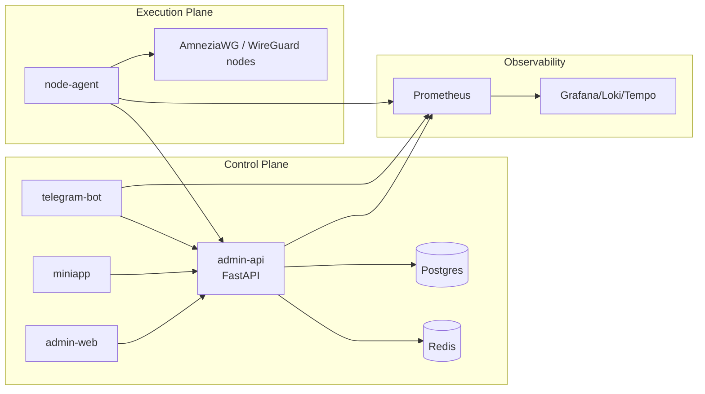
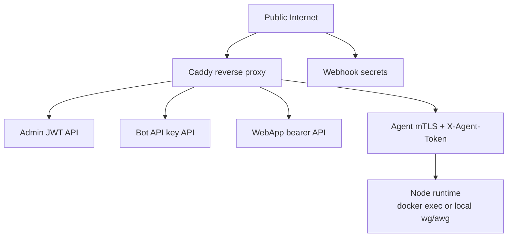

# As-Built Architecture

Repository-aligned architecture for the current VPN Suite implementation.

## Supported product posture

- Release status: public beta.
- Current operating envelope: homelab and small-ops.
- Production recommendation: `NODE_DISCOVERY=agent` and `NODE_MODE=agent`.
- Development and single-host support: docker runtime adapter.

## System split

## Repo entrypoints

| Component | Path | Role |
|-----------|------|------|
| Admin API | `apps/admin-api/app/main.py` | Control-plane API, auth, orchestration, telemetry aggregation |
| Admin web | `apps/admin-web/` | Operator UI for servers, devices, telemetry, billing, automation |
| Mini App | `apps/miniapp/` | User self-service flows |
| Telegram bot | `apps/telegram-bot/main.py` | Sales gateway and self-service bot |
| Node agent | `apps/node-agent/agent.py` | Local reconcile loop on VPN hosts |
| Ops CLI | `manage.sh` | Canonical operational entrypoint |
| Compose | `infra/compose/docker-compose.yml` | Core local/dev deployment topology |

## Runtime ownership model

- Desired state lives in the control plane database.
- Peer mutation ownership in production belongs to `node-agent`.
- Docker runtime control exists only for local/dev and single-host operation.
- AmneziaWG nodes are black boxes from the control-plane perspective. There is no public node HTTP management API.

## Background loops already present

| Loop | Path | Current role |
|------|------|--------------|
| Node scan | `app/core/node_scan_task.py` | Docker-based discovery and topology sync |
| Server sync | `app/core/server_sync_loop.py` | Snapshot/sync loop with backoff and rate limits |
| Health checks | `app/core/health_check_task.py` | Periodic server health collection |
| Limits checks | `app/core/limits_check_task.py` | Policy enforcement background loop |
| Telemetry polling | `app/core/telemetry_polling_task.py` | Telemetry aggregation |
| Automation | `app/core/control_plane_automation_task.py` | Control-plane automation/status |
| Docker alerts | `app/core/docker_alert_polling_task.py` | Docker alert rule polling |

## Trust boundaries

## Current control-plane domains

### API domains

- Admin JWT API.
- Bot API.
- WebApp API.
- Agent API.
- Payment webhooks.
- Non-versioned `/metrics`, `/health`, `/health/ready`.

### Data domains

- Auth/RBAC.
- Users, plans, subscriptions, payments.
- Servers, profiles, snapshots, sync jobs, health logs.
- Devices, issued configs, download tokens, profile issues.
- Control-plane events, funnel events, docker alerts, latency probes.
- IP pools and port allocations.

## Current architectural guarantees

- Config generation goes through the canonical config builder.
- Desired state may be persisted before runtime application completes.
- Agent mode is asynchronous convergence, not strict synchronous peer creation.
- Topology, health, and drift are first-class control-plane concerns.
- Multiple auth domains already exist and must remain explicit in docs and code.

## Current non-goals

- No public HTTP API on AWG nodes.
- No docker socket exposure outside trusted local boundaries.
- No guarantee of automatic fleet-wide failover or multi-node migration in the current release posture.
