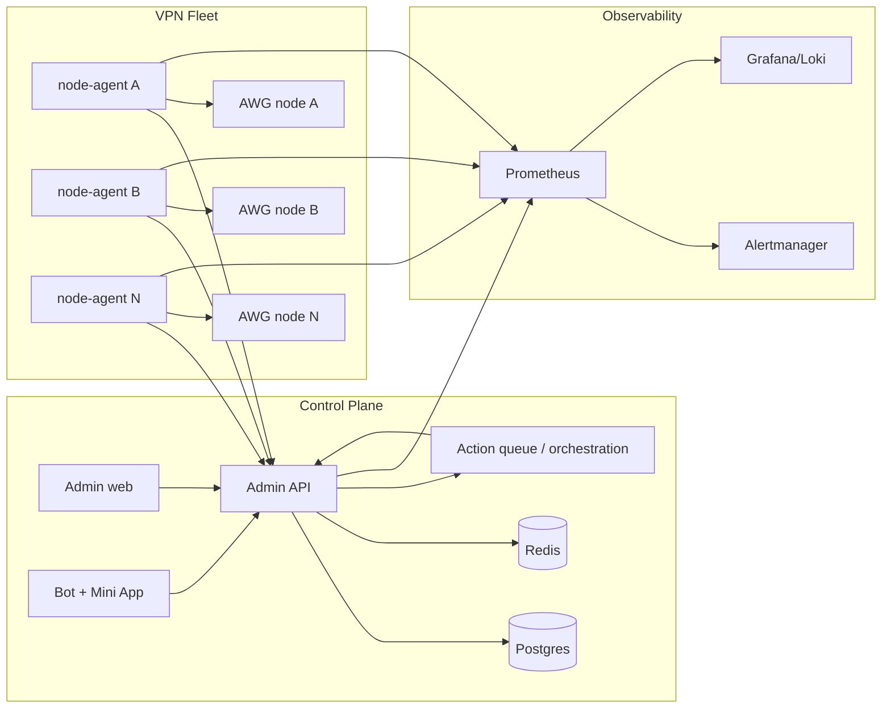

# Target Architecture

Forward architecture for evolving VPN Suite from public beta to an operator-grade multi-node platform.

## Target posture

- Control plane remains FastAPI + Postgres + Redis.
- Production node mutation remains agent-owned.
- Multi-node scheduling, reconciliation, and failover become explicit, versioned platform behaviors.
- Docker mode remains a developer convenience, not a production topology.

## Evolution goals

1. Formal action orchestration.
2. Defined desired-state convergence semantics.
3. Versioned agent protocol.
4. Deterministic placement and drain behavior.
5. Soft failover planning with safe retries.
6. Stronger rollout, rollback, and observability gates.

## Target topology

## Required contracts before expansion

### Action orchestration

- Action lifecycle states.
- Retry and timeout behavior.
- Compensation rules.
- Operator-visible action history.

### Reconciliation

- Desired-state freshness rules.
- Drift precedence rules.
- Safe replay and idempotency semantics.
- Stale desired-state cleanup.

### Agent protocol

- Versioned heartbeat, desired-state, telemetry, peer list, and action schemas.
- Mixed-version compatibility policy.
- Explicit capability negotiation for new agent features.

### Scheduling

- Deterministic placement score.
- Hard exclusions before scoring.
- Drain and maintenance semantics.
- Failover evaluation for degraded/unreachable nodes.

## Target operational properties

- Idempotent node mutations.
- Operator-visible reconciliation status.
- Consistent issuance states across admin, bot, and miniapp surfaces.
- Alerts for stale heartbeats, reconcile failures, and provisioning failures.
- Rollout order documented for control-plane-first vs agent-first changes.

## Out of scope for the next 1-2 releases

- Fully automatic peer migration across nodes.
- Enterprise tenancy or compliance features beyond the documented production baseline.
- Any control-plane design that depends on a public AWG node API.
