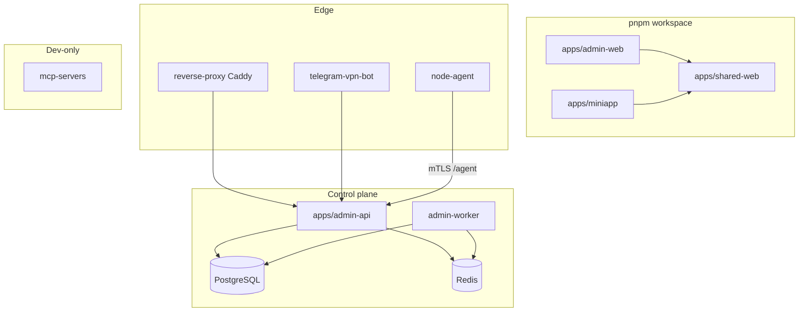

# Module dependency graph

## Notes

- **Runtime vs build:** `shared-web` is a compile-time dependency of both frontends; there is no runtime HTTP coupling between SPA and shared package beyond bundled JS.
- **Bot → API:** HTTP to internal `admin-api:8000` (`PANEL_URL`), plus Telegram servers; not direct DB access.
- **node-agent → API:** Outbound HTTPS with client certs; Docker socket is local-only.
- **admin-api ↔ Docker:** API and worker mount `docker.sock` for WG/container operations in supported modes.
- **Circular imports:** Python `app/models` uses forward refs; Ruff/Mypy overrides in `pyproject.toml` — not shown in graph.
- **Optional compose profiles:** Monitoring, `agent`, `docker-telemetry` change which boxes run together.

